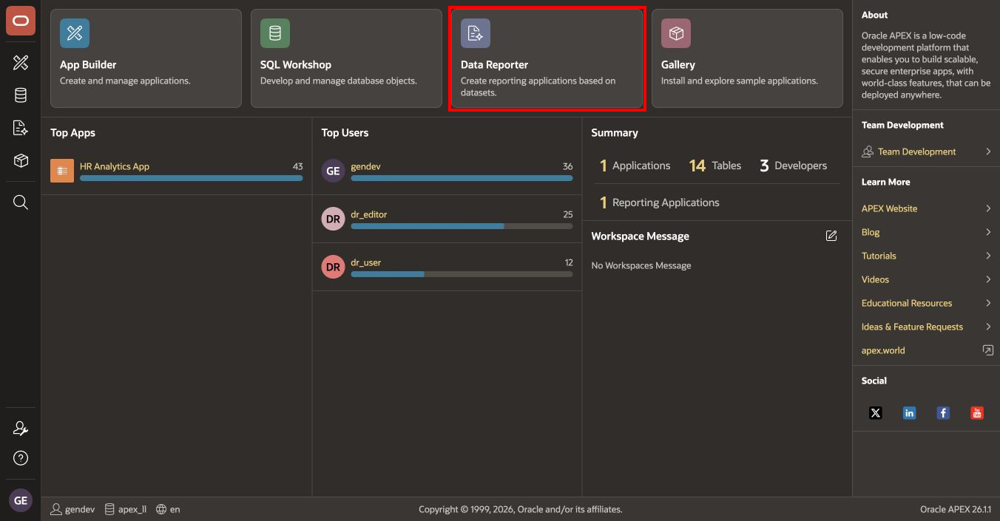

# What Is Data Reporter and Who Is It For? Set Up the Authentication Scheme

## Introduction

Oracle APEX Data Reporter separates governed data preparation from business-user reporting. A Data Reporter administrator exposes approved tables or views through datasets, editors build and publish reports, and viewers consume those reports in a focused reporting application.

In this lab, you will review the role of Data Reporter and configure its authentication scheme.

Estimated Lab Time: 10 minutes

### Where We Are

The Talent Management System schema and operational applications already exist. HAA is still a temporary application. Before rebuilding it, Data Reporter must use an authentication scheme that supports the workshop's role-based users.

### Objectives

In this lab, you will:

- Identify the responsibilities of Data Reporter administrators, editors, and viewers.
- Make **Oracle APEX Accounts** the current Data Reporter authentication scheme.
- Open Data Reporter from the APEX workspace and verify the setting.

## Task 1: Understand the Data Reporter Roles

The three Data Reporter roles used in this module are:

| Role | Module User | Responsibility |
| --- | --- | --- |
| Administrator | `DR_ADMIN` | Manages datasets, reporting applications, users, and role assignments. |
| Editor | `DR_EDITOR` | Creates, configures, and publishes reports in an assigned reporting application. |
| Viewer | `DR_USER` | Opens published reports and uses their search, filter, chart, and group-by features. |

The dataset is the governance boundary. It exposes only the database objects required for reporting. In this module, the dataset contains three views rather than the underlying operational tables.

## Task 2: Configure the Data Reporter Authentication Scheme

> **Note:** This is a one-time instance-level task. If you cannot open APEX Administration Services, ask your instance administrator or workshop instructor to complete these steps.

1. Sign in to **APEX Administration Services** as an Instance Administrator.

2. Select **Manage Instances**, and then select **Security**.

3. In **Data Reporter Authentication Schemes**, open **Oracle APEX Accounts**.

4. If you are using APEX on Autonomous Database, edit **Oracle APEX Accounts** and mark it as **Current**.

5. Save the change and sign out of APEX Administration Services.

6. Sign in to the workshop workspace. On the APEX workspace home page, select **Data Reporter**.

    

7. Review the Data Reporter home page.

    If a reporting application is already present, its **Authentication Scheme** column must display **Oracle APEX Accounts**. Your page may initially contain no reporting applications; you will create HAA in Lab 2.

    

> **Troubleshooting:** If Data Reporter redirects to an unexpected identity provider or the workshop accounts cannot sign in, stop here and ask the instance administrator to verify which Data Reporter authentication scheme is marked Current.

## Summary

You reviewed the Data Reporter personas and configured Oracle APEX Accounts as the current authentication scheme.

You may now **proceed to the next lab**.

## Acknowledgements

- **Author** - Shanmukh Kornana
- **Last Updated By/Date** - Shanmukh Kornana, July 2026
