# Create the Required Views and Replace the Existing HR Analytics App

## Introduction

In this lab, you will remove the temporary App Builder version of HAA, create three reporting views, assemble them into a governed dataset, and create the Data Reporter application.

Estimated Lab Time: 15 minutes

### Where We Are

Data Reporter uses Oracle APEX Accounts. The operational `TMS_` tables contain the data, but they are not yet shaped for business reporting.

### Objectives

In this lab, you will:

- Remove only the old HAA skeleton from App Builder.
- Create three reporting views.
- Create **HR Analytics App Dataset** from those views.
- Create the **HR Analytics App** reporting application.

## Task 1: Remove the Temporary HAA Application

> **Important:** Delete only the old App Builder application named **HR Analytics App** or **HAA**. Do not delete TAP, ESS, Data Reporter applications, or any other workspace application.

1. From the APEX workspace home page, select **App Builder**.

2. In **Applications**, search for the old **HR Analytics App** application.

    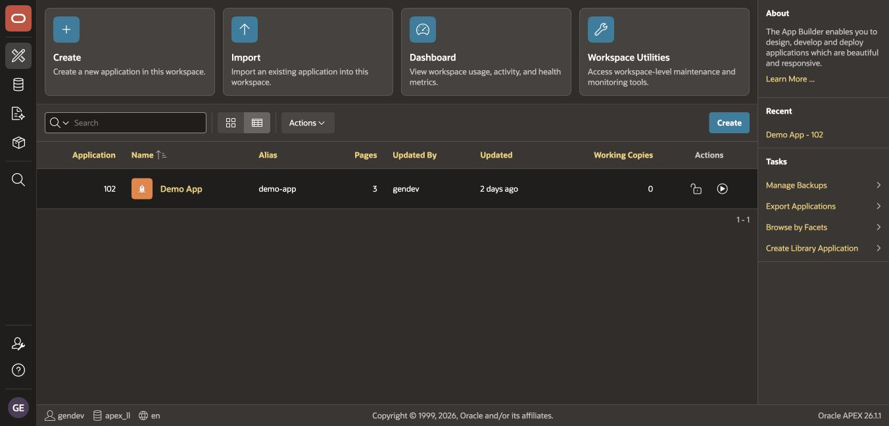

3. If the application exists:

    - Open the application.
    - Open **Edit Application Definition**.
    - Select **Delete**.
    - Verify the application name and ID before confirming.

4. If no HAA application is listed, continue to the next task. The screenshot shows an example workspace after the temporary HAA application has been removed; your other applications may differ.

## Task 2: Create the Reporting Views

The views present stable, human-readable reporting columns and keep joins and calculated values out of the report editor.

1. Return to the APEX workspace home page, open **SQL Workshop**, and select **SQL Scripts**.

    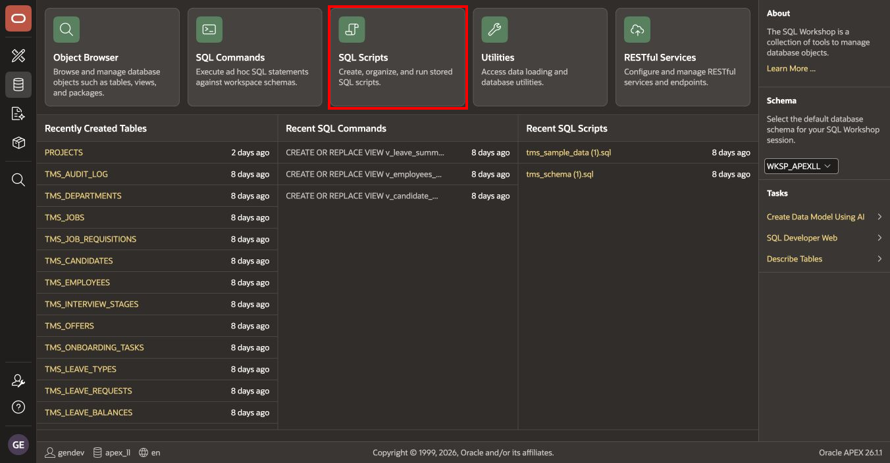

2. On the **SQL Scripts** page, select **Create**.

3. For **Script Name**, enter `module9_create_reporting_views.sql`.

4. Copy the following four statements into the script editor. You can also open the included [module9_create_reporting_views.sql](files/module9_create_reporting_views.sql) file and copy its contents.

    ```sql
    CREATE OR REPLACE VIEW v_candidate_pipeline AS
    SELECT c.candidate_id,
           c.req_id,
           c.first_name || ' ' || c.last_name AS candidate_name,
           c.current_stage,
           c.source,
           c.applied_date,
           j.title AS job_title,
           d.name AS department,
           TRUNC(SYSDATE - c.applied_date) AS days_in_pipeline
      FROM tms_candidates c
      JOIN tms_job_requisitions r
        ON c.req_id = r.req_id
      JOIN tms_jobs j
        ON r.job_id = j.job_id
      JOIN tms_departments d
        ON r.dept_id = d.dept_id;

    CREATE OR REPLACE VIEW v_employees_summary AS
    SELECT e.employee_id,
           e.candidate_id,
           e.first_name || ' ' || e.last_name AS employee_name,
           e.email,
           j.title AS job_title,
           d.name AS department,
           e.manager_id,
           e.salary,
           e.hire_date,
           e.status,
           TRUNC(SYSDATE - e.hire_date) AS days_employed,
           e.created_by,
           e.created_at,
           e.updated_by,
           e.updated_at
      FROM tms_employees e
      LEFT JOIN tms_jobs j
        ON e.job_id = j.job_id
      LEFT JOIN tms_departments d
        ON e.dept_id = d.dept_id;

    CREATE OR REPLACE VIEW v_leave_summary AS
    SELECT lr.request_id,
           lr.employee_id,
           e.first_name || ' ' || e.last_name AS employee_name,
           e.email,
           lt.name AS leave_type,
           lr.start_date,
           lr.end_date,
           lr.days_requested,
           lr.reason,
           lr.status,
           lr.approver_id,
           lr.created_by,
           lr.created_at,
           lr.updated_by,
           lr.updated_at
      FROM tms_leave_requests lr
      LEFT JOIN tms_employees e
        ON lr.employee_id = e.employee_id
      LEFT JOIN tms_leave_types lt
        ON lr.leave_type_id = lt.leave_type_id;

    SELECT object_name, status
      FROM user_objects
     WHERE object_type = 'VIEW'
       AND object_name IN (
             'V_CANDIDATE_PIPELINE',
             'V_EMPLOYEES_SUMMARY',
             'V_LEAVE_SUMMARY'
           )
     ORDER BY object_name;
    ```

5. Select **Create** to save the script.

    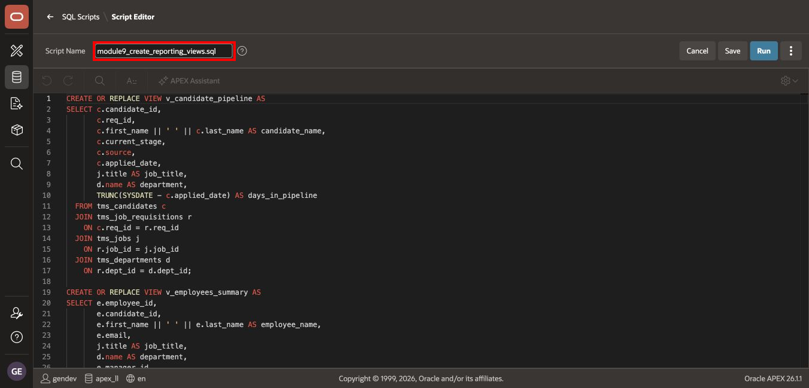

6. In the Script Editor, select **Run**.

7. On the **Run Script** confirmation page, verify that:

    - **Script Name** is `module9_create_reporting_views.sql`.
    - **Number of Statements** is `4`.
    - **Schema** is `WKSP_APEXLL`.

    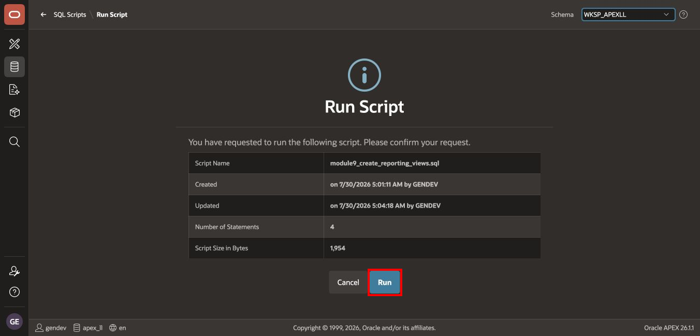

    Select **Run**.

8. Review the results. Confirm that:

    - **Status** is `Complete`.
    - All four statements are successful, with zero errors.
    - The first three statements display `View created.`
    - The verification query displays `3 rows selected.`

    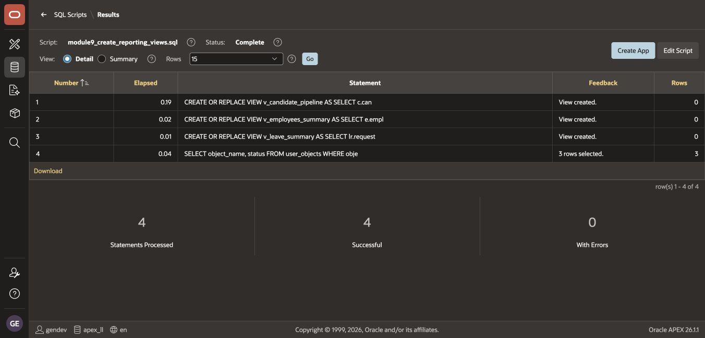

    The verification query returns `V_CANDIDATE_PIPELINE`, `V_EMPLOYEES_SUMMARY`, and `V_LEAVE_SUMMARY` with a status of `VALID`.

## Task 3: Create the HR Analytics Dataset

1. From the APEX workspace home page, select **Data Reporter**.

2. Select **Datasets**.

    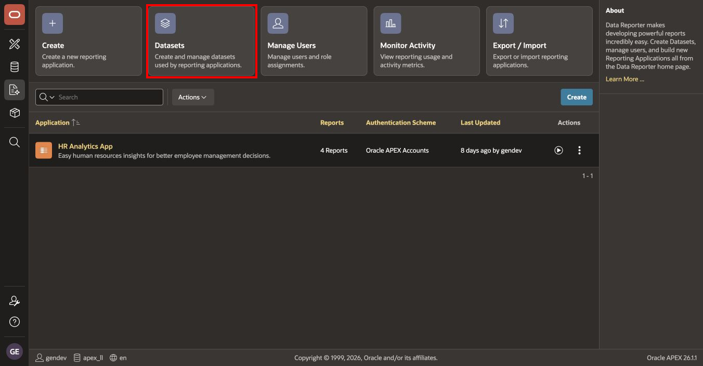

3. On **Manage Datasets**, select **Create**.

    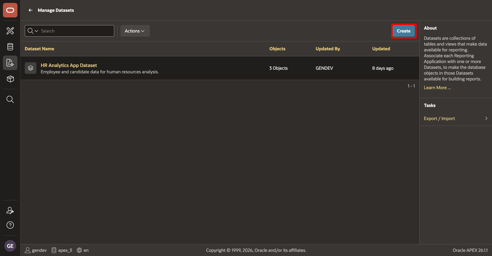

4. In **Create Dataset**:

    - For **Name**, enter `HR Analytics App Dataset`.
    - In the object search field, enter `V_`.
    - Select `V_CANDIDATE_PIPELINE`.
    - Select `V_EMPLOYEES_SUMMARY`.
    - Select `V_LEAVE_SUMMARY`.
    - Verify that the dialog displays **3 items selected**.
    - Select **Create Dataset**.

    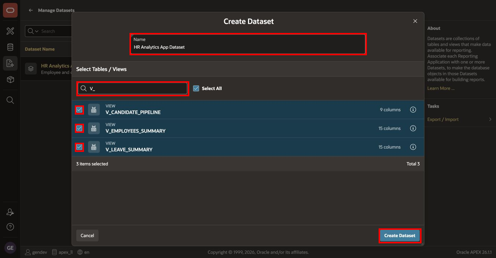

5. On **Manage Datasets**, open **HR Analytics App Dataset**.

    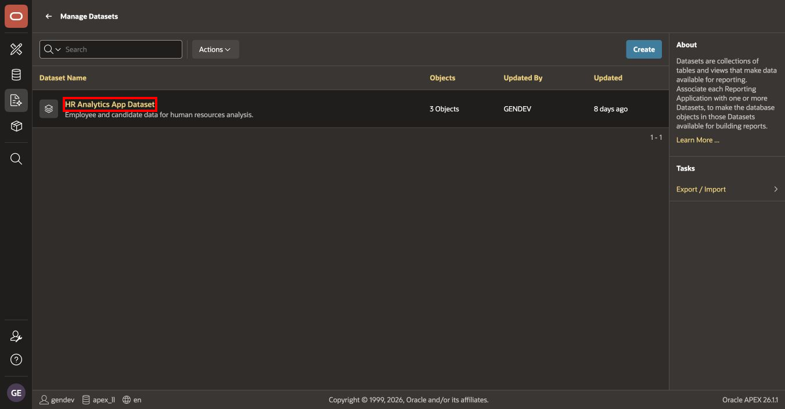

6. Confirm that the dataset contains exactly the three reporting views.

    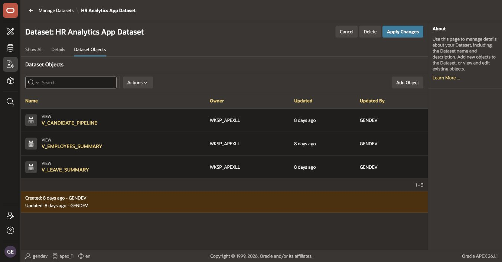

7. If a view was missed, select **Add Object**, select the missing view, and save the dataset.

    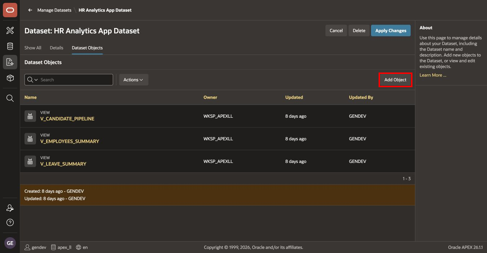

## Task 4: Create the HR Analytics Reporting Application

1. Return to the Data Reporter home page, and select **Create**.

    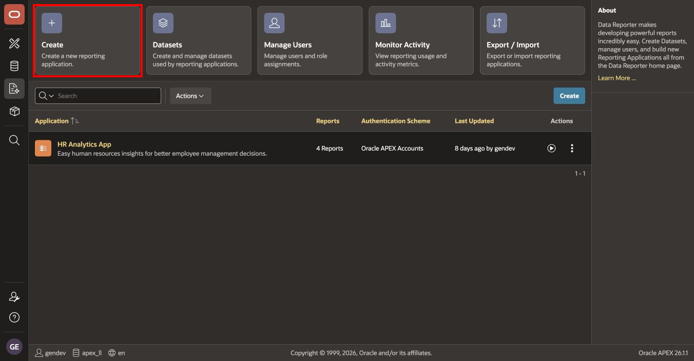

2. In **Create Reporting Application**:

    - For **Name**, enter `HR Analytics App`.
    - Select **HR Analytics App Dataset**.
    - Verify that the dataset displays **3 objects**.
    - Select **Create**.

    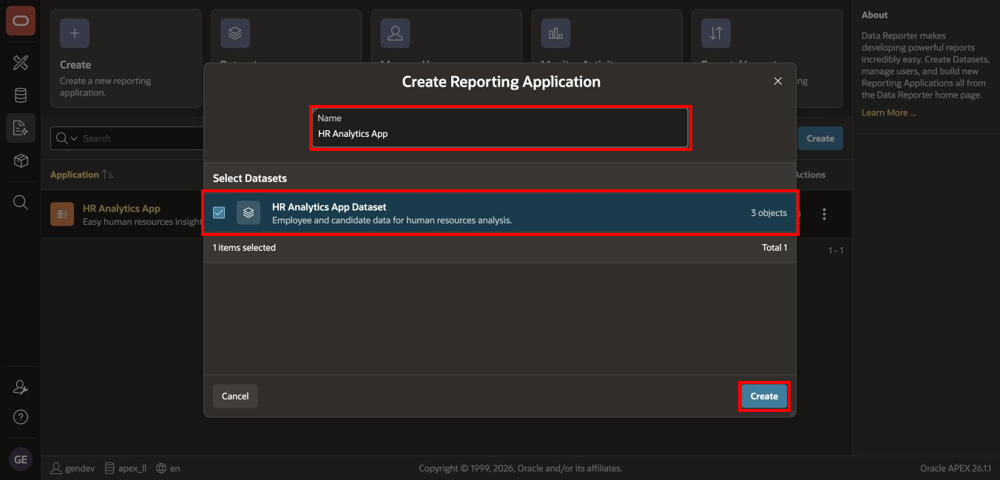

3. Confirm that **HR Analytics App** appears on the Data Reporter home page and that its authentication scheme is **Oracle APEX Accounts**.

    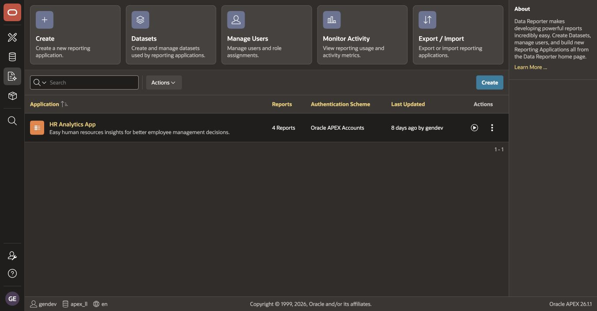

## Summary

You removed the temporary HAA application, created three reporting views, created a governed dataset, and created the HR Analytics Data Reporter application.

You may now **proceed to the next lab**.

## Acknowledgements

- **Author** - Shanmukh Kornana
- **Last Updated By/Date** - Shanmukh Kornana, July 2026
