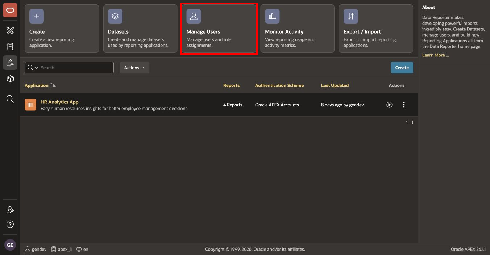
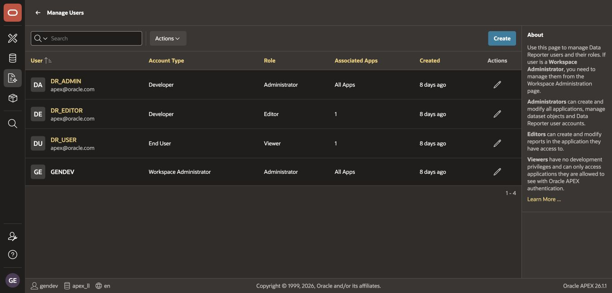
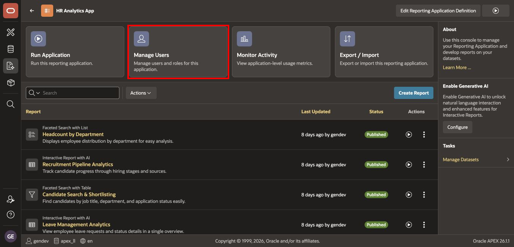
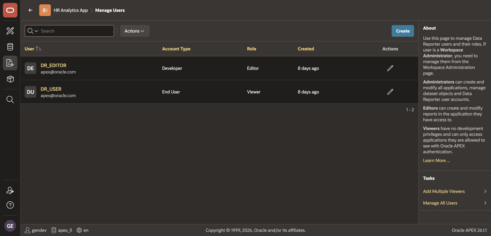
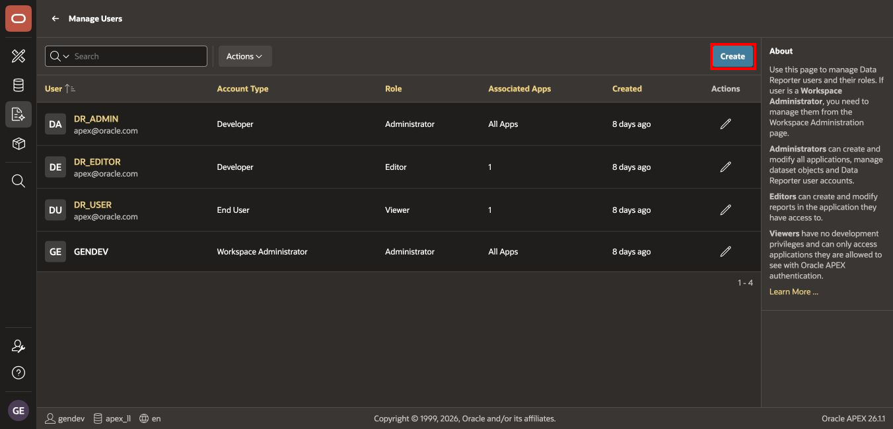
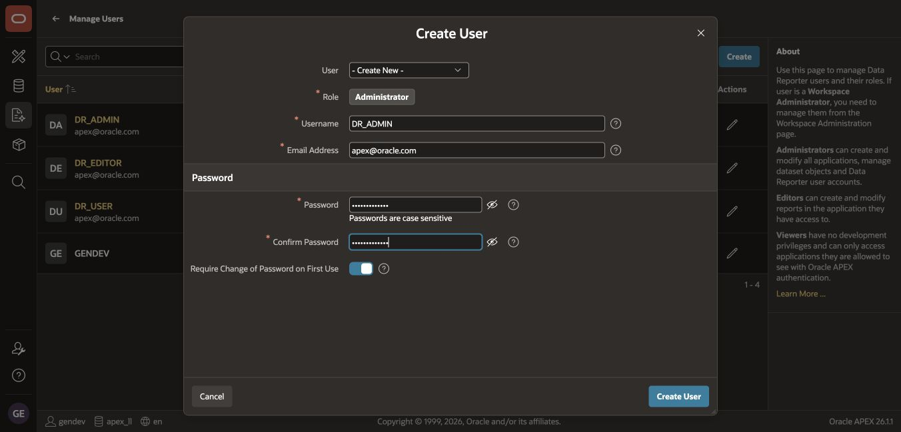
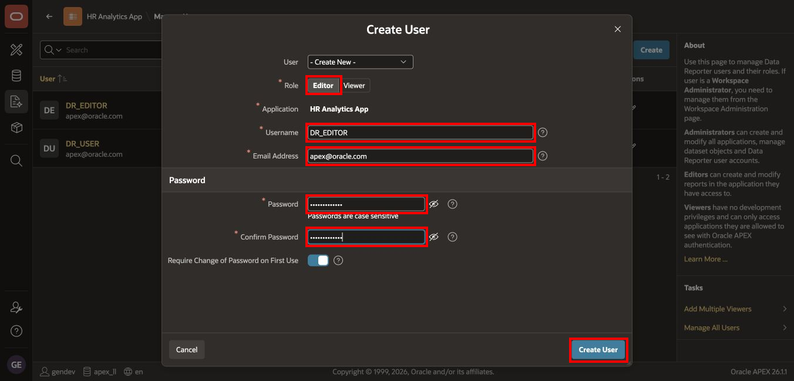
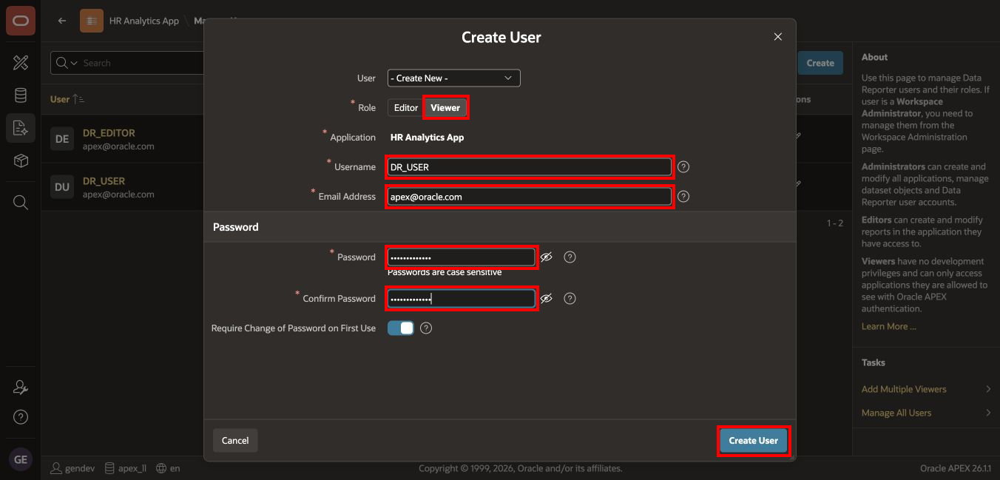

# Create or Manage Roles in Data Reporter

## Introduction

Data Reporter uses a small, deliberate role model. An Administrator governs shared resources, while each reporting application assigns Editors and Viewers according to the work they perform.

In this lab, you will review the built-in roles and create the three HAA users at the correct scope.

Estimated Lab Time: 15 minutes

### Where We Are

The HR Analytics dataset and reporting application exist, but no workshop users have been assigned yet.

### Objectives

In this lab, you will:

- Understand the scope of the Administrator, Editor, and Viewer roles.
- Review workspace-level Data Reporter users.
- Review application-level user assignments.
- Create the administrator, editor, and viewer accounts.

## Task 1: Review the Built-in Roles

Use the following role plan:

| User | Role | Scope | Required Access |
| --- | --- | --- | --- |
| `DR_ADMIN` | Administrator | Data Reporter | Manage datasets, applications, users, and assignments. |
| `DR_EDITOR` | Editor | HR Analytics App | Create, configure, run, and publish reports. |
| `DR_USER` | Viewer | HR Analytics App | Open and interact with published reports. |

Keep the following rules in mind:

- Assign **Administrator** only to the account that manages Data Reporter resources.
- Assign **Editor** inside the reporting application rather than granting administrative access.
- Assign **Viewer** to end users who consume reports.
- Do not use a shared administrator account for normal report editing or viewing.

## Task 2: Review Data Reporter Users

1. On the Data Reporter home page, select **Manage Users**.

    

2. Review the user list and role column.

    A completed environment contains `DR_ADMIN`, `DR_EDITOR`, and `DR_USER`. A new environment may initially contain only your workspace developer account.

    

3. Check for accounts whose names differ only by letter case. Oracle APEX user names are commonly treated case-insensitively during authentication, so do not create both `DR_USER` and `dr_user`.

4. Check that no existing workshop account has broader access than the role plan requires.

## Task 3: Review Application-Level Assignments

1. Return to the Data Reporter home page and open **HR Analytics App**.

2. On the reporting application page, select **Manage Users**.

    

3. Review the application assignments.

    The target state contains:

    - `DR_EDITOR` with the **Editor** role.
    - `DR_USER` with the **Viewer** role.

    `DR_ADMIN` does not need a second application-specific assignment because the Administrator role already provides management access.

    

4. If the target assignments already exist, do not create duplicates. You can verify or update them in the next lab.

## Task 4: Create the Data Reporter Administrator

1. Return to the Data Reporter home page and select **Manage Users**.

2. Select **Create User**.

    

3. In **Create User**:

    - For **User**, select **Create New**.
    - For **Role**, select **Administrator**.
    - For **Username**, enter `DR_ADMIN`.
    - Enter the email address supplied for your workshop environment.
    - Enter and confirm the workshop password.
    - Set **Require Change of Password on First Use** according to your instructor's guidance.
    - Select **Create User**.

    

4. Confirm that `DR_ADMIN` appears in the Data Reporter user list with the **Administrator** role.

## Task 5: Create the Application Editor and Viewer

1. Open **HR Analytics App**, and select **Manage Users**.

2. Select **Create User**.

3. Create the editor account:

    - For **User**, select **Create New**.
    - For **Role**, select **Editor**.
    - For **Username**, enter `DR_EDITOR`.
    - Enter the email address and workshop password.
    - Confirm the password.
    - Select **Create User**.

    

4. Select **Create User** again.

5. Create the viewer account:

    - For **User**, select **Create New**.
    - For **Role**, select **Viewer**.
    - For **Username**, enter `DR_USER`.
    - Enter the email address and workshop password.
    - Confirm the password.
    - Select **Create User**.

    

6. Confirm that `DR_EDITOR` and `DR_USER` appear in the application's user list with the correct roles.

    

> **Note:** Data Reporter roles are separate from the APEX authorization schemes that you will build later in the course. A Data Reporter role does not automatically grant the same privileges in TAP or ESS.

## Task 6: Confirm the Access Model

Before continuing, confirm all of the following:

- The reporting application uses **Oracle APEX Accounts**.
- `DR_ADMIN` will receive only the Data Reporter **Administrator** role.
- `DR_EDITOR` will receive the **Editor** role for **HR Analytics App**.
- `DR_USER` will receive the **Viewer** role for **HR Analytics App**.
- Passwords will come from the workshop environment and will not be committed to source control.

## Summary

You reviewed the Data Reporter role model and created the administrator, editor, and viewer accounts at the correct scope.

You may now **proceed to the next lab**.

## Acknowledgements

- **Author** - Shanmukh Kornana
- **Last Updated By/Date** - Shanmukh Kornana, July 2026
