# Create Data Reporter Users and Build Reports in Data Reporter

## Introduction

The Data Reporter users are ready. In this lab, you will return to the HR Analytics App and create four reports from the governed dataset.

The curriculum title retains “Create Data Reporter Users,” but the named users were created at the correct scopes in Lab 3. The remaining work in this lab is report construction.

Estimated Lab Time: 20 minutes

### Where We Are

HAA has a dataset, a reporting application, and role-based users. It does not yet have the reports required by HR.

### Objectives

In this lab, you will:

- Create two Interactive Reports and two Faceted Search reports.
- Configure recruitment and leave group-by summaries.
- Configure a bar chart and a pie chart.
- Save the Interactive Report settings as the Primary Default.

## Task 1: Open the Report Builder

1. On the Data Reporter home page, open **HR Analytics App**.

2. Select **Create Report**.

    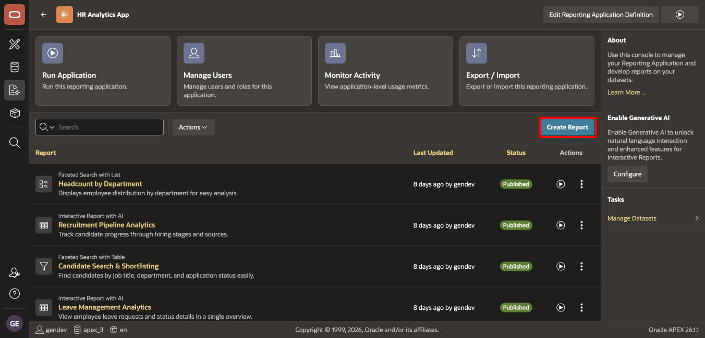

The completed application will contain four published reports.

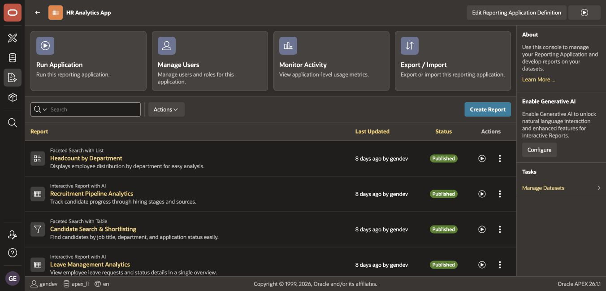

## Task 2: Create Recruitment Pipeline Analytics

This report gives HR leadership insight into the recruitment pipeline. Because Generative AI is already configured in the workspace, the Interactive Report includes AI-assisted search.

1. In **Create a Report**:

    - For **Name**, enter `Recruitment Pipeline Analytics`.
    - Select **Interactive Report**.
    - Select **Next**.

    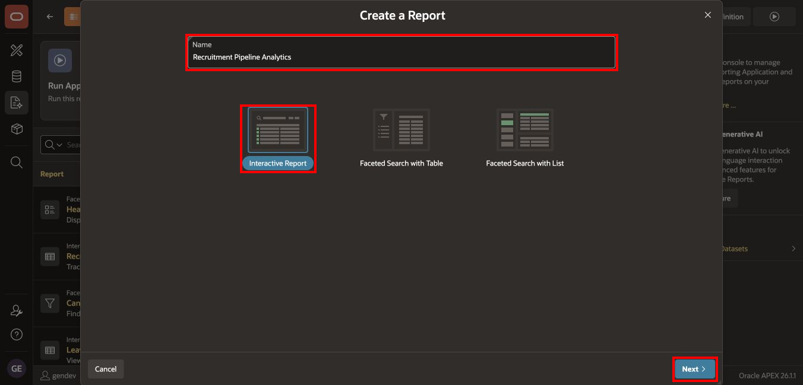

2. In **Select Report Source**:

    - Keep **Table or View** selected.
    - Verify that **HR Analytics App Dataset** is selected.
    - Select `V_CANDIDATE_PIPELINE`.
    - Select **Create Report**.

    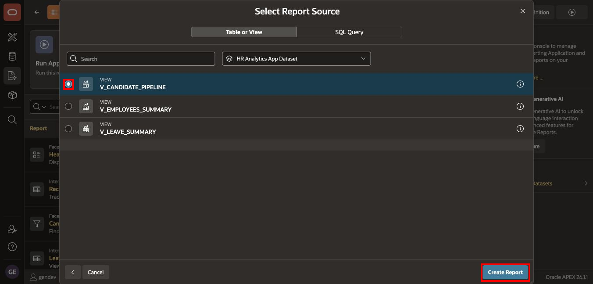

3. On the report details page, select **Edit Report** and set the description to:

    `Give HR leadership insights into the recruitment pipeline.`

4. Save the report, and then select **Run**.

5. Sign in as `DR_EDITOR` using the password supplied in your workshop environment.

    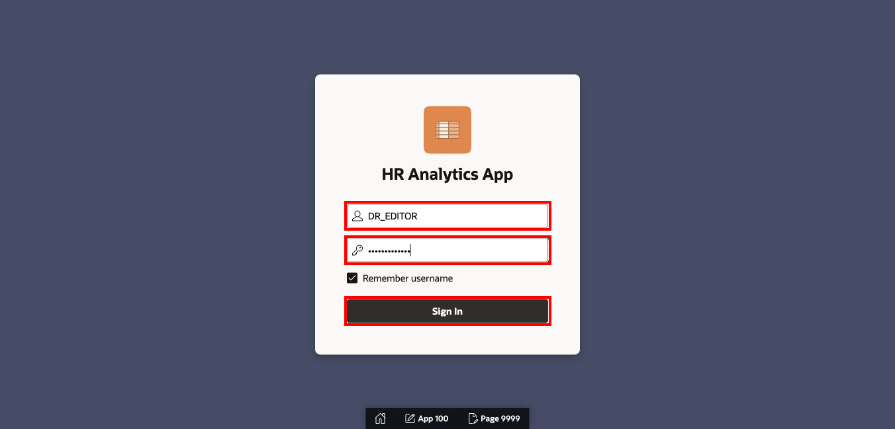

### Configure the Stage Summary

6. Select **Actions**, and then select **Group By**.

    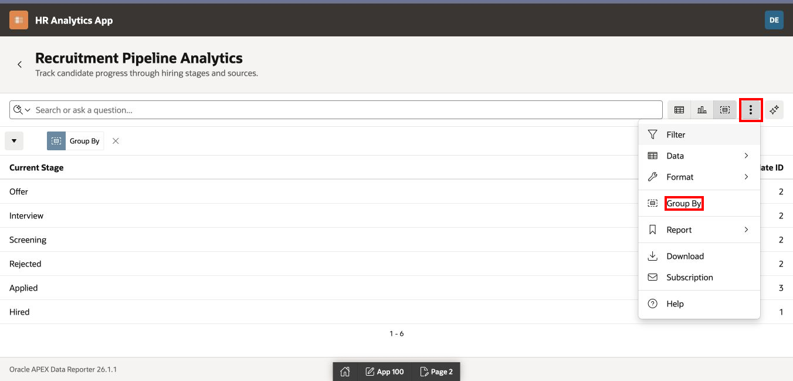

7. In **Group By**:

    - For **Group By Column 1**, select **Current Stage**.
    - For **Function 1**, select **Count**.
    - For **Column 1**, select **Candidate ID**.
    - Select **Apply**.

    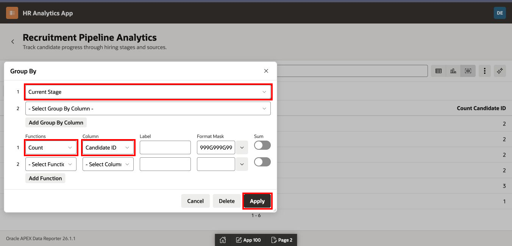

8. Confirm that the Group By view shows one row per recruitment stage and a candidate count.

    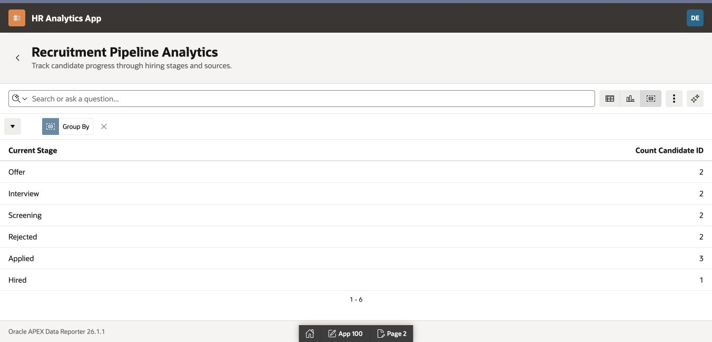

### Configure the Average Days-in-Pipeline Chart

9. Select **Actions**, select **Chart**, and configure:

    - **Chart Type**: Bar
    - **Label**: Department
    - **Value**: Days in Pipeline
    - **Function**: Average
    - **Axis Title for Value**: `Average Time to Hire`

10. Select **Apply**.

    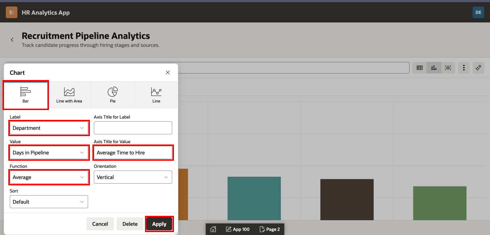

11. Confirm that the Chart view displays average days in the pipeline by department.

    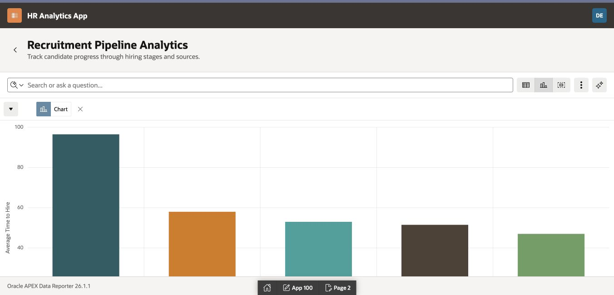

### Save the Primary Default

12. Select **Actions**, select **Report**, and then select **Save Report**.

13. For **Save**, select **As Default Report Settings**.

14. In **Save Default Report**, select **Primary**, and then select **Apply**.

    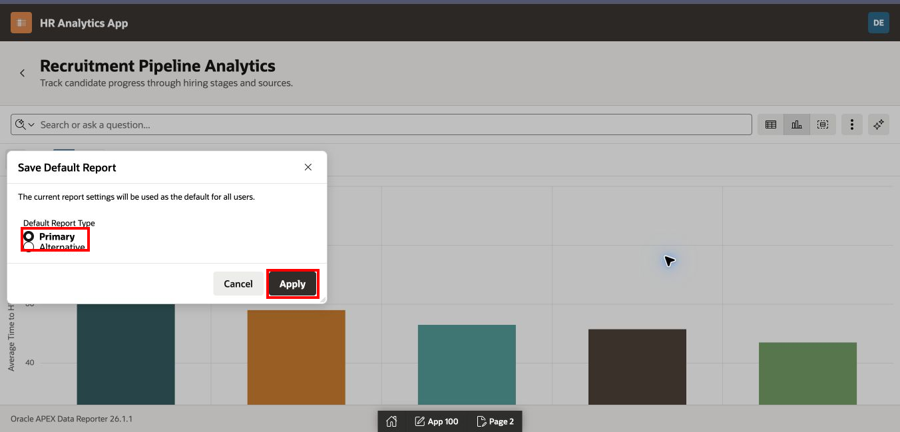

## Task 3: Create Candidate Search and Shortlisting

1. Return to the HR Analytics App report builder and select **Create Report**.

2. In **Create a Report**:

    - For **Name**, enter `Candidate Search & Shortlisting`.
    - Select **Faceted Search with Table**.
    - Select **Next**.

    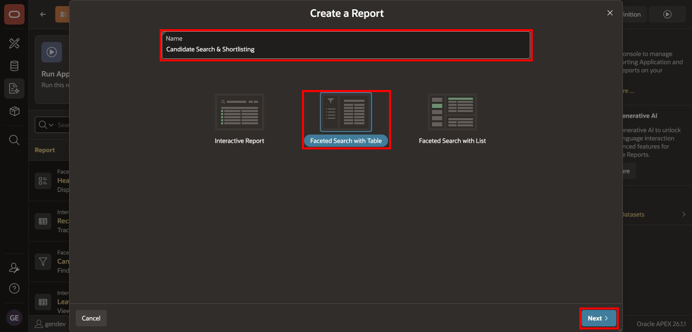

3. Select `V_CANDIDATE_PIPELINE`, and then select **Create Report**.

4. Edit the report and set the description to:

    `Find candidates by job title, department, and application status easily.`

5. Configure the report to display:

    - Candidate Name
    - Job Title
    - Department
    - Current Stage; change the label to `Stage` if required by your workshop
    - Source
    - Applied Date
    - Days in Pipeline

6. Hide Candidate ID and Requisition ID from the default table unless your instructor wants the technical identifiers available.

7. Keep or add facets for **Current Stage**, **Source**, **Applied Date**, **Job Title**, and **Department**.

8. Save and run the report. Confirm that selecting a facet filters the candidate table.

    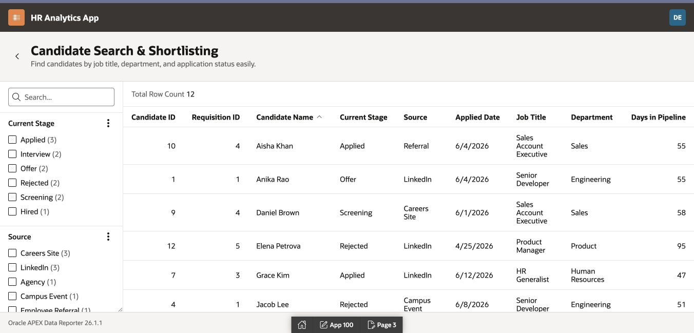

## Task 4: Create the Employee Directory

The Module 9 design calls this report **Employee Directory**. The completed reference application publishes the same configuration as **Headcount by Department**. Use `Headcount by Department` to match the reference screenshots; use `Employee Directory` only if your instructor requires that title.

1. Return to the HR Analytics App report builder and select **Create Report**.

2. In **Create a Report**:

    - For **Name**, enter `Headcount by Department`.
    - Select **Faceted Search with List**.
    - Select **Next**.

    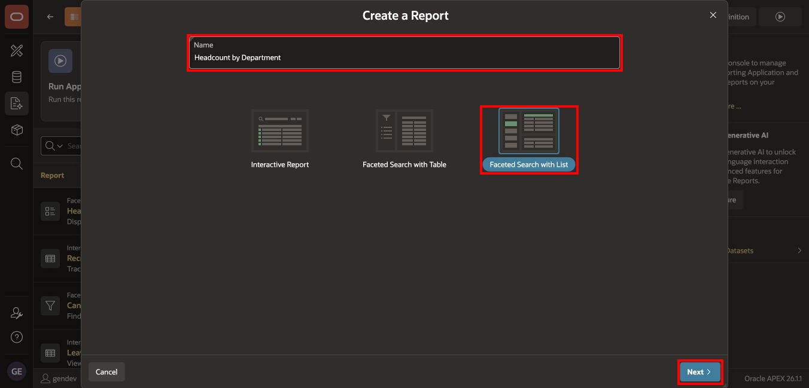

3. Select `V_EMPLOYEES_SUMMARY`, and then select **Next**.

    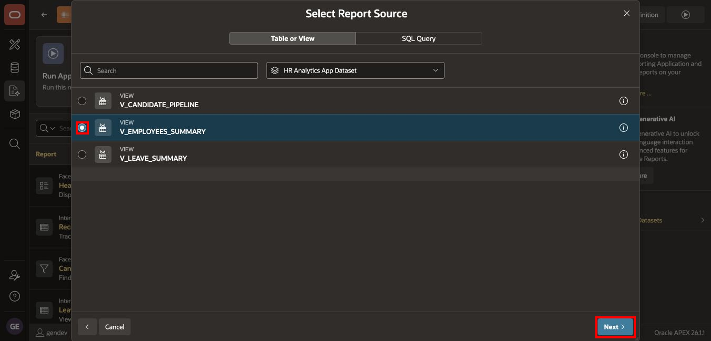

4. In **Configure Display Options and Facets**, configure:

    - **Title**: Employee Name
    - **Description**: Job Title
    - **Overline**: Department
    - **Miscellaneous**: Status
    - **Order By Column**: Hire Date

5. Select these facets:

    - Department
    - Job Title
    - Status; use the label `Employment Status`
    - Hire Date

6. Verify that Employee Name, Job Title, Department, Hire Date, and Status are displayed, and then select **Create Report**.

    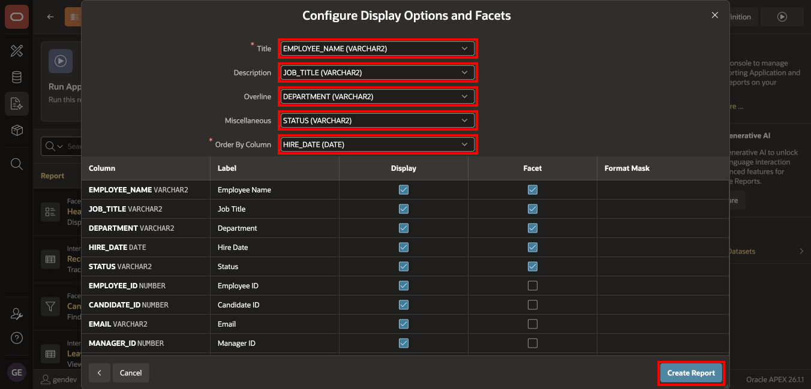

7. Edit the report and set the description to:

    `Displays employee distribution by department for easy analysis.`

8. Save and run the report. Confirm that the list shows employee name, job title, department, and status.

    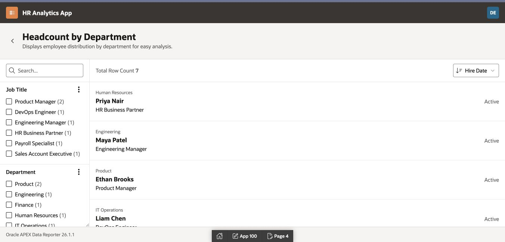

## Task 5: Create Leave Management Analytics

This report provides HR with insight into employee leave requests and utilization.

1. Return to the HR Analytics App report builder and select **Create Report**.

2. In **Create a Report**:

    - For **Name**, enter `Leave Management Analytics`.
    - Select **Interactive Report**.
    - Select **Next**.

    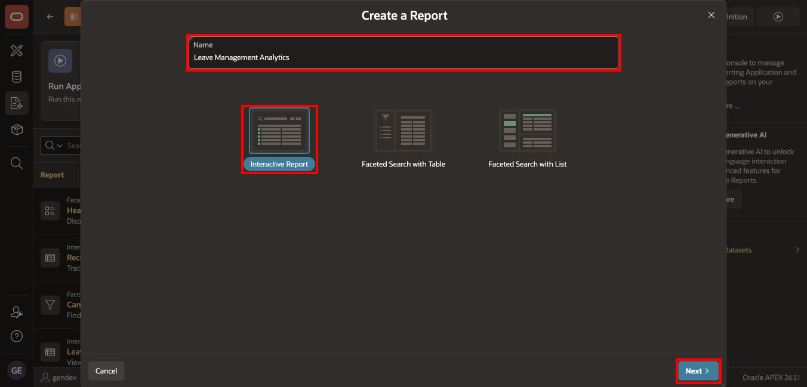

3. Select `V_LEAVE_SUMMARY`, and then select **Create Report**.

    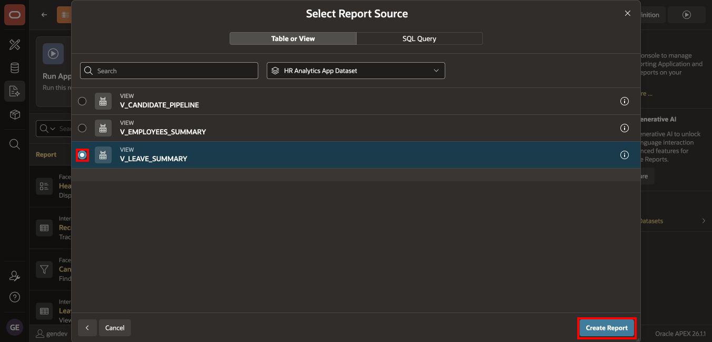

4. Edit the report and set the description to:

    `Provide HR with insights into employee leave requests and utilization.`

5. Save the report and run it as `DR_EDITOR` or `DR_ADMIN`.

### Configure the Leave-Type Summary

6. Select **Actions**, and then select **Group By**.

7. In **Group By**:

    - For **Group By Column 1**, select **Leave Type**.
    - For **Function 1**, select **Count**.
    - For **Column 1**, select **Request ID**.
    - Select **Apply**.

    

8. Confirm that the Group By view shows the number of requests for each leave type.

    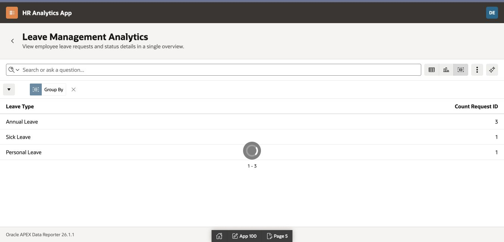

### Configure the Leave-Type Pie Chart

9. Select **Actions**, select **Chart**, and configure:

    - **Chart Type**: Pie
    - **Label**: Leave Type
    - **Value**: Request ID
    - **Function**: Count

    The combination of **Request ID** and **Count** represents the Module 9 requirement, **Count of Leave Requests**.

10. Select **Apply**.

    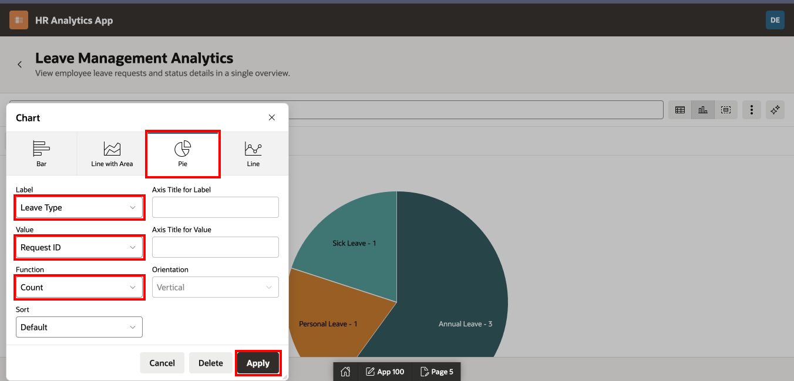

11. Confirm that the Chart view displays leave-request counts by leave type.

    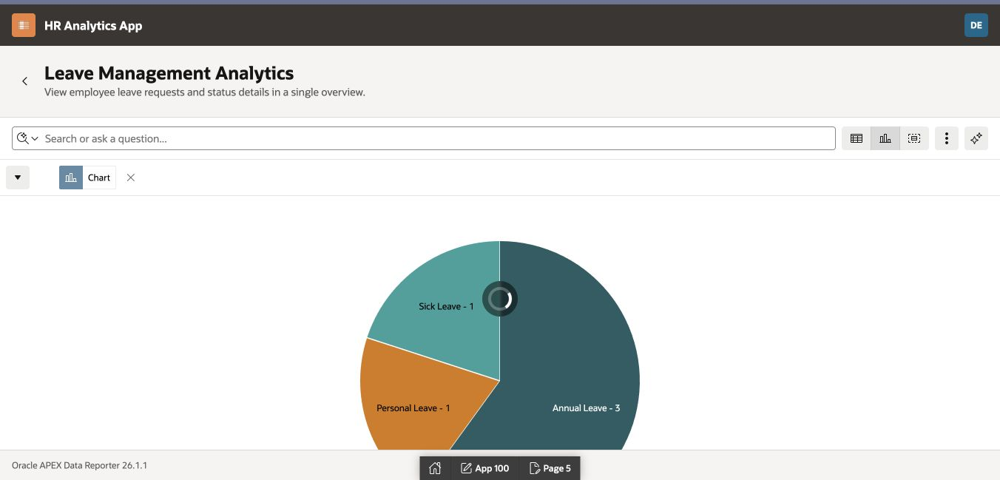

12. Save the current report settings as the **Primary** default:

    - Select **Actions**.
    - Select **Report**, and then select **Save Report**.
    - For **Save**, select **As Default Report Settings**.
    - Select **Primary**, and then select **Apply**.

## Task 6: Verify the Four Reports

1. Return to the HR Analytics App report builder.

2. Confirm that the application contains:

    - Recruitment Pipeline Analytics
    - Candidate Search & Shortlisting
    - Headcount by Department, implementing the Employee Directory design
    - Leave Management Analytics

3. Confirm that each report uses the expected source view and type.

    | Report | Type | Source |
    | --- | --- | --- |
    | Recruitment Pipeline Analytics | Interactive Report | `V_CANDIDATE_PIPELINE` |
    | Candidate Search & Shortlisting | Faceted Search with Table | `V_CANDIDATE_PIPELINE` |
    | Headcount by Department / Employee Directory | Faceted Search with List | `V_EMPLOYEES_SUMMARY` |
    | Leave Management Analytics | Interactive Report | `V_LEAVE_SUMMARY` |

## Summary

You created four HR reports, configured the recruitment and leave summaries, and saved the Interactive Report settings as Primary Defaults.

You may now **proceed to the next lab**.

## Acknowledgements

- **Author** - Shanmukh Kornana
- **Last Updated By/Date** - Shanmukh Kornana, July 2026
