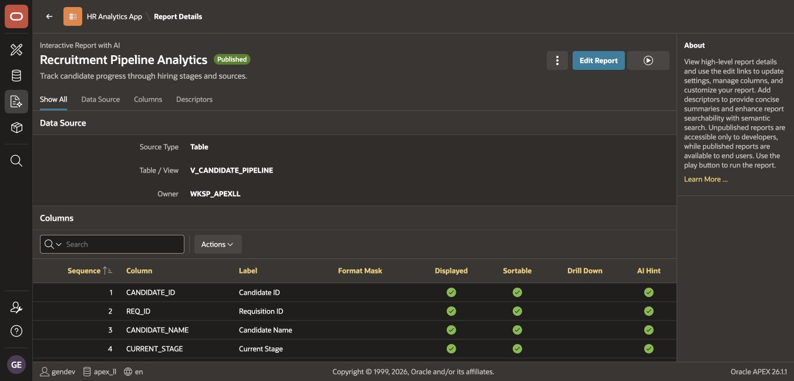
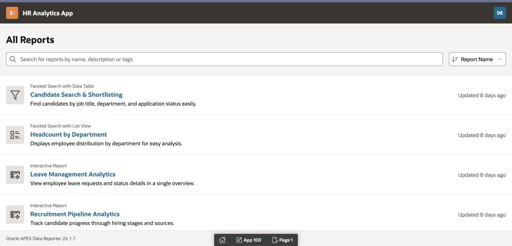
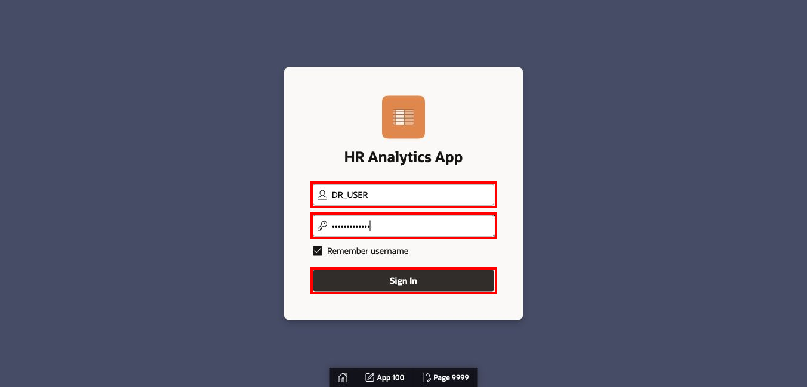
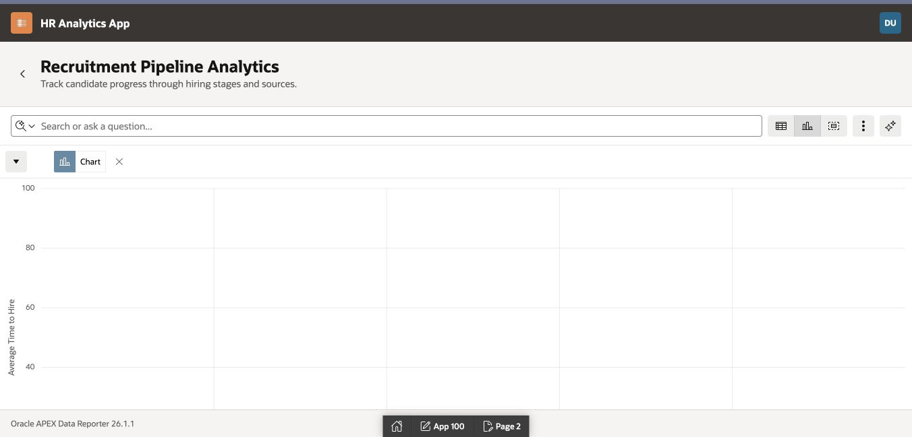

# Publish and Review as an End User

## Introduction

Unpublished Data Reporter reports are available only to developers. In this lab, you will publish all four HAA reports and validate the final experience as `DR_USER`.

Estimated Lab Time: Final validation included in the 60-minute workshop

### Where We Are

The reports and their Primary Default settings are complete. They must now be published and tested with viewer-level access.

### Objectives

In this lab, you will:

- Publish all four reports.
- Confirm the editor report catalog.
- Sign in as the Data Reporter viewer.
- Validate report visibility, filtering, charts, and group-by summaries.

## Task 1: Publish the Reports

1. In Data Reporter, open **HR Analytics App**.

2. Open **Recruitment Pipeline Analytics**.

3. Use the report **Actions** menu to select **Publish**, and confirm the action.

4. Confirm that the report details page displays **Published**.

    

5. Return to the report list and publish:

    - Candidate Search & Shortlisting
    - Headcount by Department
    - Leave Management Analytics

6. Confirm that all four reports display the **Published** status.

    

> **Note:** Publishing controls end-user visibility. Saving an Interactive Report as the Primary Default controls the initial report layout. Both steps are required.

## Task 2: Verify the Editor Catalog

1. Run **HR Analytics App** and sign in as `DR_EDITOR`.

2. Confirm that **All Reports** contains the four published reports.

    

3. Open **Recruitment Pipeline Analytics** and verify:

    - The Group By view summarizes candidates by Current Stage.
    - The Chart view shows average Days in Pipeline by Department.

4. Open **Leave Management Analytics** and verify:

    - The Group By view summarizes requests by Leave Type.
    - The Chart view shows the leave-type distribution.

5. Sign out.

## Task 3: Sign In as the End User

1. On the HR Analytics App sign-in page:

    - For **Username**, enter `DR_USER`.
    - For **Password**, enter the password supplied in the workshop environment.
    - Select **Sign In**.

    

2. Confirm that **All Reports** contains the four published reports.

    

3. If a report is missing:

    - Confirm that the report is Published.
    - Confirm that `DR_USER` has the Viewer role in HR Analytics App.
    - Sign out and sign in again after correcting the assignment.

## Task 4: Validate Each Report

1. Open **Recruitment Pipeline Analytics**.

2. Confirm that the report opens with its saved Primary Default and displays the published chart.

    

3. Select the Group By view and confirm that the stage counts are present.

4. Return to **All Reports** and open **Candidate Search & Shortlisting**.

5. Select one or more facets and confirm that the candidate table is filtered.

    

6. Return to **All Reports** and open **Headcount by Department**.

7. Confirm that the employee list displays name, job title, department, and status. Test at least one Department or Job Title facet.

    

8. Return to **All Reports** and open **Leave Management Analytics**.

9. Confirm that the report contains leave-request data, the Leave Type group-by summary, and the pie chart.

    

## Task 5: Complete the Acceptance Check

Confirm every item before completing the module:

- Data Reporter uses Oracle APEX Accounts.
- `V_CANDIDATE_PIPELINE`, `V_EMPLOYEES_SUMMARY`, and `V_LEAVE_SUMMARY` are valid.
- HR Analytics App Dataset contains exactly the three reporting views.
- `DR_ADMIN` is the Data Reporter Administrator.
- `DR_EDITOR` is an Editor for HR Analytics App.
- `DR_USER` is a Viewer for HR Analytics App.
- All four reports are Published.
- Recruitment Pipeline Analytics has a stage count and average days-in-pipeline bar chart.
- Candidate Search & Shortlisting has the required candidate fields and usable facets.
- Headcount by Department implements the Employee Directory list and facets.
- Leave Management Analytics has a leave-type count and pie chart.
- `DR_USER` can open and interact with every report.

## Summary

You published and validated the HR Analytics App as an end user. HAA is now a governed Data Reporter application for recruitment, employee, and leave analytics.

This application carries forward to the advanced analytics work later in the course.

You may now **proceed to the next module**.

## Acknowledgements

- **Author** - Shanmukh Kornana
- **Last Updated By/Date** - Shanmukh Kornana, July 2026
