# Brand ESS with Theme Roller

## Introduction

Oracle APEX Theme Roller lets you change Universal Theme variables while the application is running. You can preview a palette immediately, save the result as a named theme style, and make more than one style available to end users.

In this lab, you will create a teal and green **ESS Light** style, create **ESS Dark** from the Vita Dark base, and allow employees to choose their preferred style.

Estimated Lab Time: 4 minutes

### Where We Are

ESS is functionally complete enough for employees to navigate, but it still uses the starter Universal Theme appearance. It needs a warmer identity that is visually distinct from the recruiter-facing TAP application.

### Objectives

In this lab, you will:

- Open Theme Roller from a running ESS application.
- Create and save the **ESS Light** style.
- Create and save the **ESS Dark** style.
- Enable the end-user theme-style selector.
- Switch the running application to ESS Dark.

## Task 1: Run ESS and Open Theme Roller

1. Sign in to your Oracle APEX workspace.

2. Select **App Builder**, and then open **15_01: Employee Self-Service Portal** (**App 153**).

3. On the application home page, select **Run Application**.

    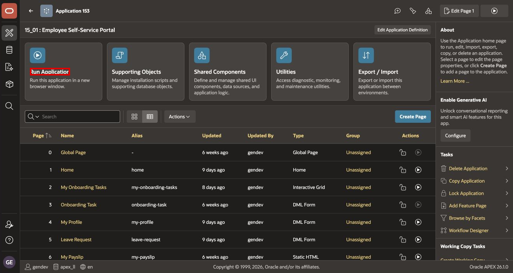

4. If a login page appears, sign in with the ESS credentials supplied in your workshop environment.

5. On the Developer Toolbar at the bottom of the application, select **Customize**.

    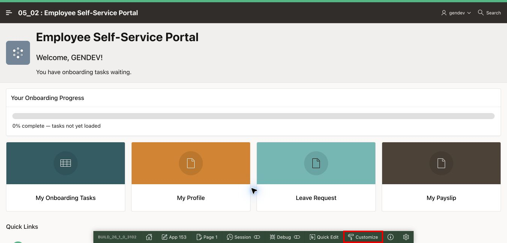

6. Select **Theme Roller**.

    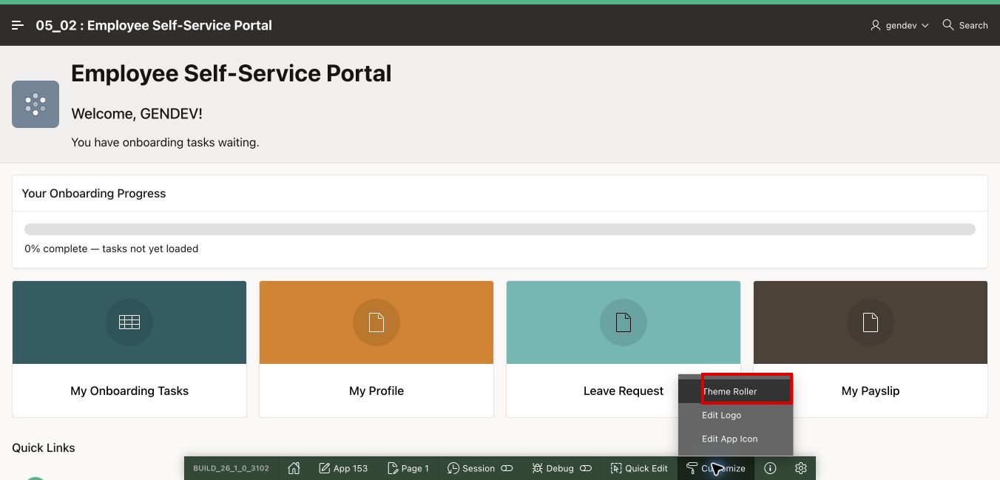

Theme Roller opens on the right side of the page. Keep the application visible while you work so that you can see each style change.

## Task 2: Create the ESS Light Style

1. In Theme Roller, expand **Palette**.

    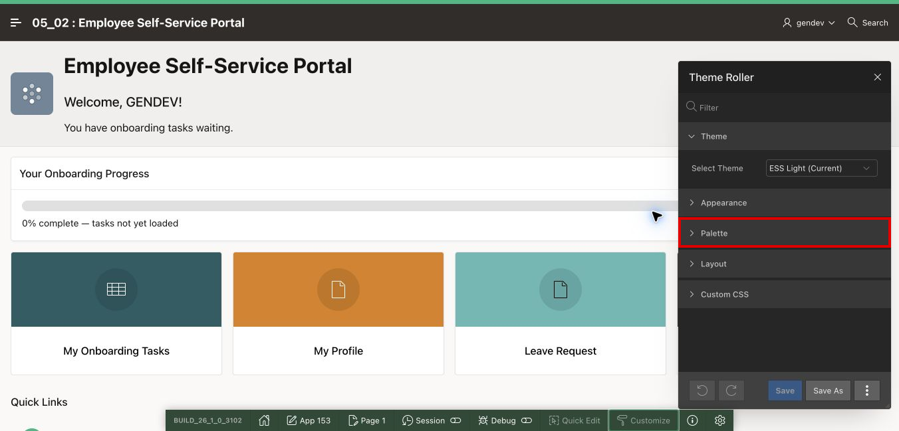

2. Expand **Appearance** if it is collapsed.

3. For **Pillar**, select **Teal**. Observe that the page header, navigation, buttons, and components update together.

    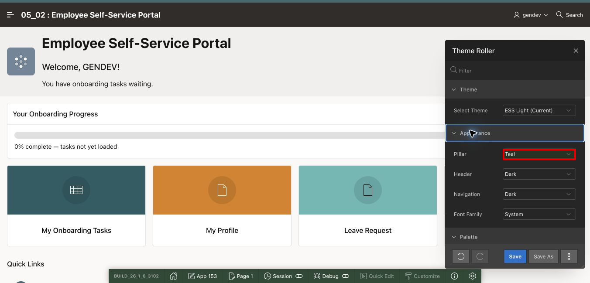

4. For **Pillar**, now select **Custom**. The **Accent** color control appears.

    This second choice keeps the teal-based preview as your starting point while allowing you to enter the exact ESS accent color.

5. For **Accent**, select the color swatch.

    

6. In **Hex**, enter `10b981`. A leading `#` is not required in the APEX color picker.

    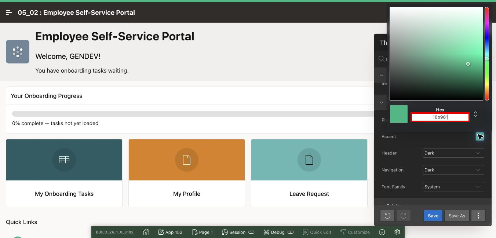

7. Click outside the color picker to close it. Review the application preview.

    > **Note:** APEX 26.1 applies Theme Roller changes immediately. Some earlier versions display a **Refresh** button; if your version displays it, select **Refresh** before continuing.

8. At the bottom of Theme Roller, select **Save As**.

    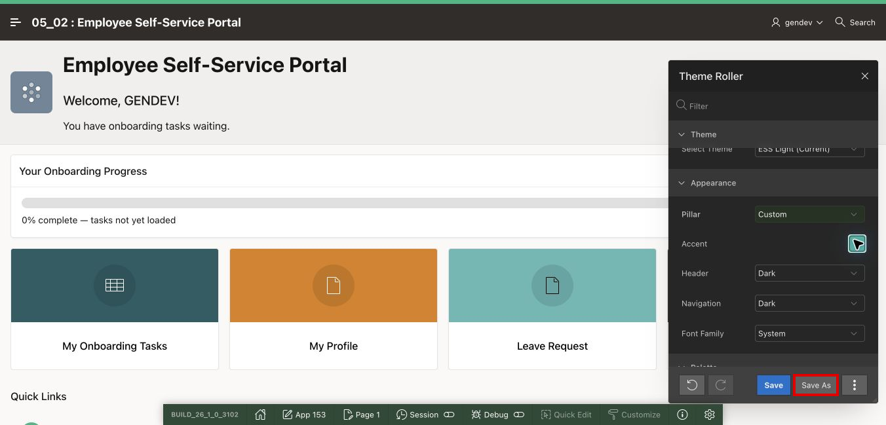

9. For **Style Name**, enter `ESS Light`, and then select **Save**.

    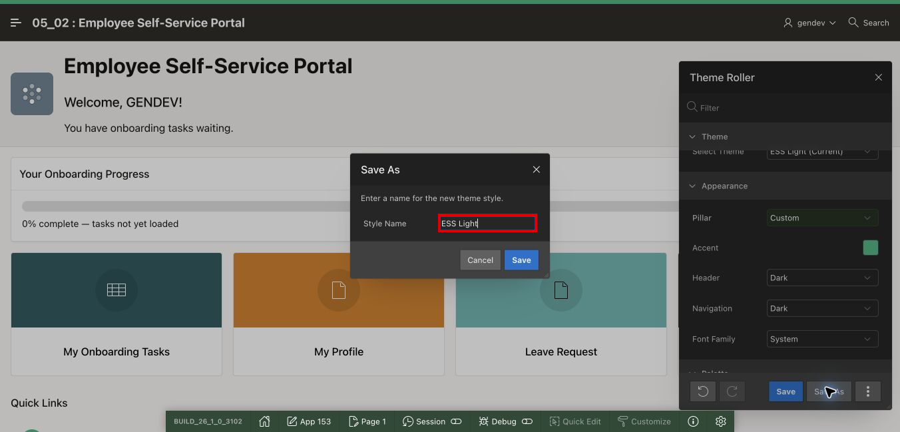

    If `ESS Light` already exists in a shared reference environment, do not create a duplicate. Select the existing style or use a temporary unique name supplied by your instructor.

## Task 3: Create the ESS Dark Style

1. In the **Theme** section, open **Select Theme**, and select **Vita - Dark**.

    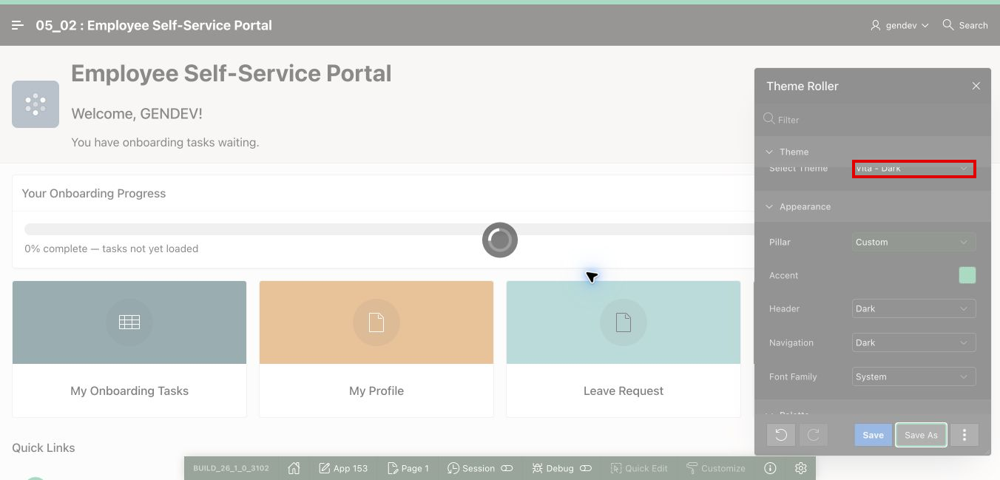

2. If APEX warns that unsaved customizations will be lost, confirm only after you have saved ESS Light.

3. Select **Save As**.

4. For **Style Name**, enter `ESS Dark`, and then select **Save**.

    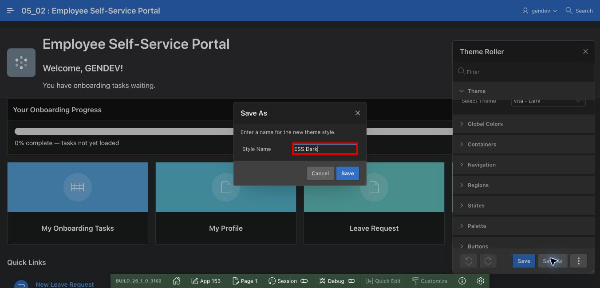

5. Close Theme Roller.

At this point, the application contains two named styles. **ESS Light** remains the application default; **ESS Dark** is available as a user preference.

## Task 4: Let Employees Choose a Theme Style

1. Return to App Builder and open the ESS application home page.

2. Select **Shared Components**.

    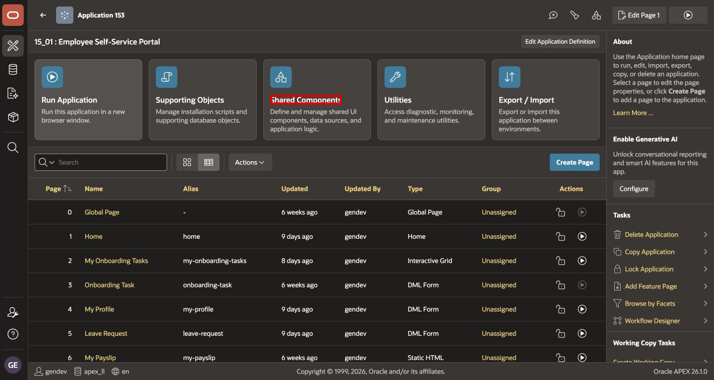

3. In **User Interface**, select **User Interface Attributes**.

    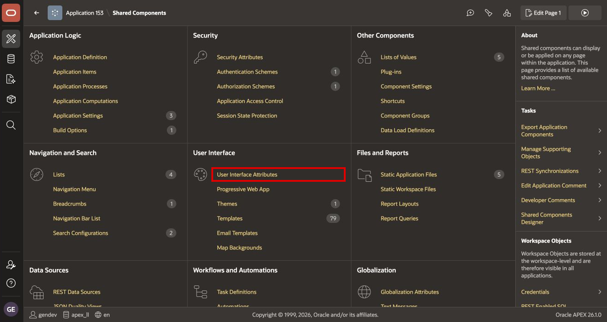

4. Select the **Attributes** tab.

5. Set **Enable End Users to choose Theme Style** to **On**.

    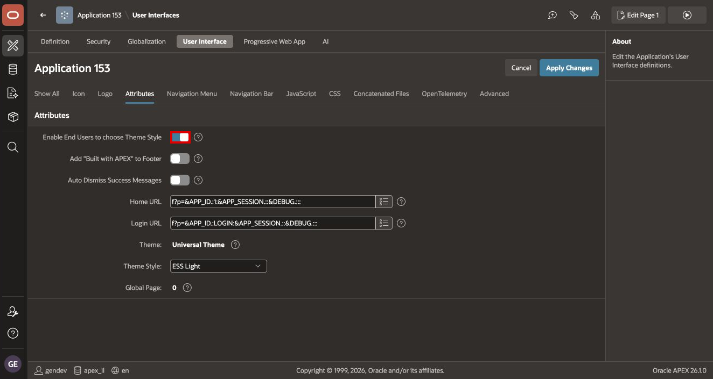

6. Verify that **Theme Style** is `ESS Light`. This keeps the light style as the default for users who have not chosen a preference.

7. Select **Apply Changes**.

## Task 5: Test the End-User Theme Choice

1. Run ESS again.

2. Scroll to the application footer, and select **Customize**. This footer link is the end-user style chooser; it is different from **Customize > Theme Roller** on the Developer Toolbar.

    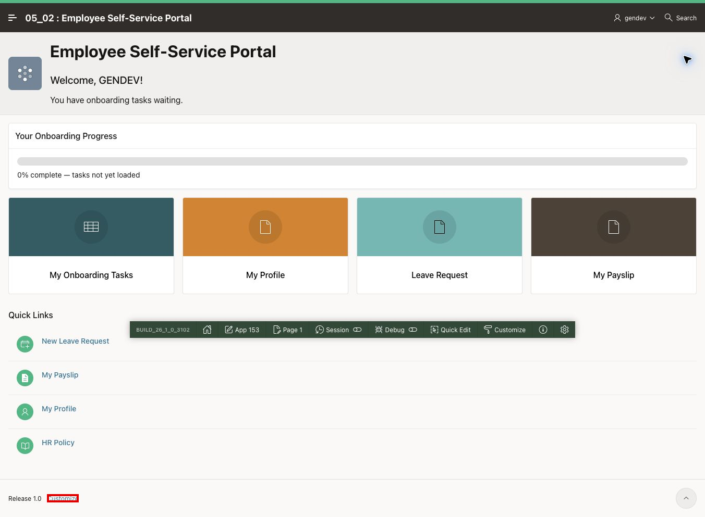

3. In the **Customize** dialog, select **ESS Dark**.

    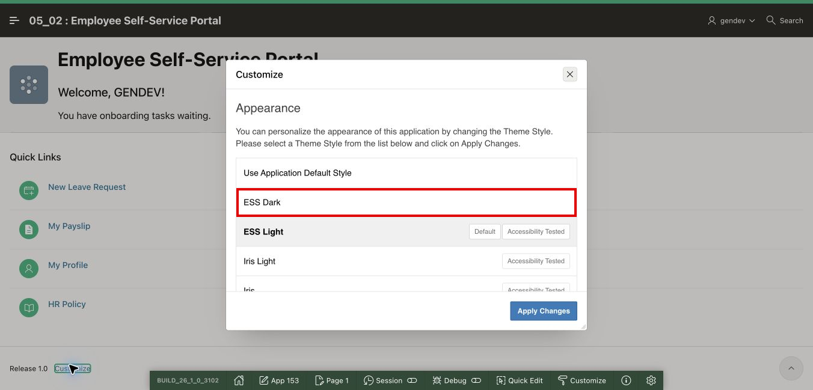

4. Select **Apply Changes**.

    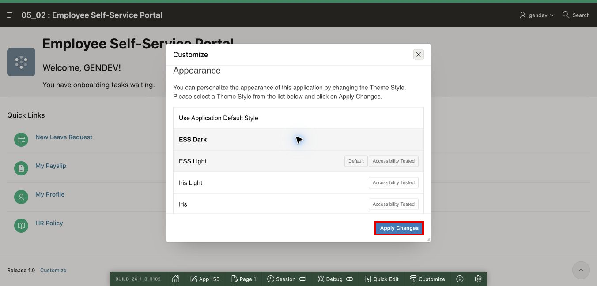

5. Confirm that the page changes to the dark style and remains usable.

    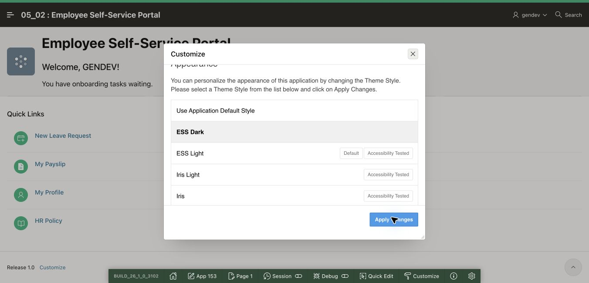

6. Open **Customize** once more and return to **Use Application Default Style** or **ESS Light** before the next lab.

## Summary

You created ESS Light and ESS Dark, made the light style the application default, and enabled employees to select a theme preference at runtime.

You may now **proceed to the next lab**.

## Acknowledgements

- **Author** - Shanmukh Kornana
- **Last Updated By/Date** - Shanmukh Kornana, August 2026
