# Add State-Aware Status Badges to ESS

## Introduction

The **My Onboarding Tasks** page currently uses an Interactive Grid. In this lab, you will present the tasks as an Interactive Report and use the built-in Badge column type to show each task status with a semantic state.

The badge retains the text value, so employees do not have to interpret color alone. A completed task is marked `success`, a blocked task is marked `danger`, an overdue task is marked `warning`, and every other task is marked `info`.

Estimated Lab Time: 2 minutes

### Where We Are

ESS now has light and dark theme styles. The onboarding task report still needs a clear, accessible visual treatment that works in both styles.

### Objectives

In this lab, you will:

- Convert the Onboarding Tasks region to an Interactive Report.
- Add a computed `STATUS_STATE` value to the SQL query.
- Hide the computed helper column.
- Render `STATUS` as a subtle Badge whose state comes from `STATUS_STATE`.

## Task 1: Open My Onboarding Tasks

1. In App Builder, open **15_02: Employee Self-Service Portal** (**App 154**).

2. In the Pages report, select **My Onboarding Tasks**.

    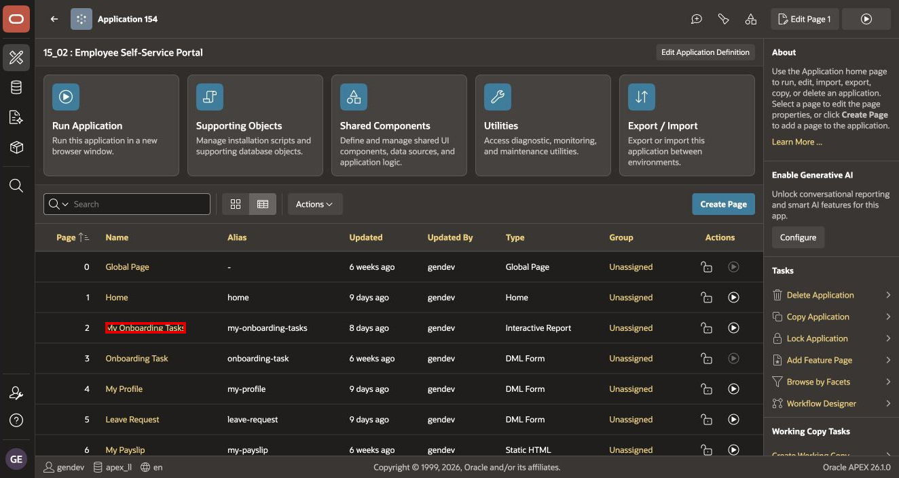

3. In Page Designer, under **Rendering > Body**, select the **Onboarding Tasks** region.

    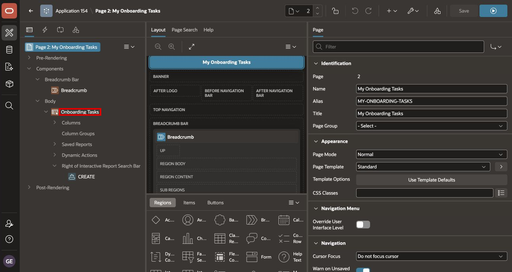

## Task 2: Convert the Region and Update Its SQL

1. In the Property Editor, under **Identification**, set **Type** to **Interactive Report**.

    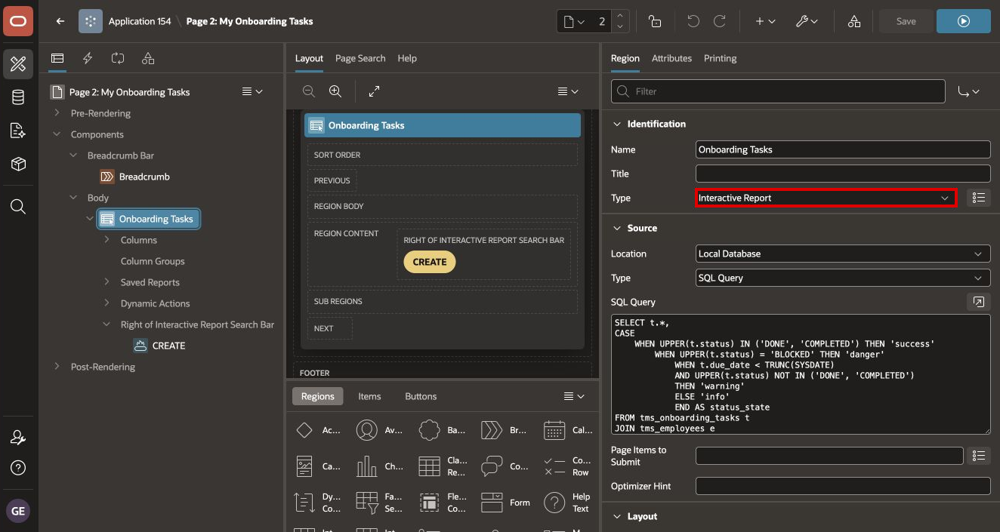

2. Under **Source**, set **Type** to **SQL Query**.

3. Replace the existing SQL Query with the following code:

    ```sql
    SELECT t.*,
           CASE
               WHEN UPPER(t.status) IN ('DONE', 'COMPLETED') THEN 'success'
               WHEN UPPER(t.status) = 'BLOCKED' THEN 'danger'
               WHEN t.due_date < TRUNC(SYSDATE)
                    AND UPPER(t.status) NOT IN ('DONE', 'COMPLETED')
                   THEN 'warning'
               ELSE 'info'
           END AS status_state
    FROM tms_onboarding_tasks t
    JOIN tms_employees e
      ON e.employee_id = t.employee_id
    WHERE LOWER(e.email) = LOWER(:APP_USER)
    ```

    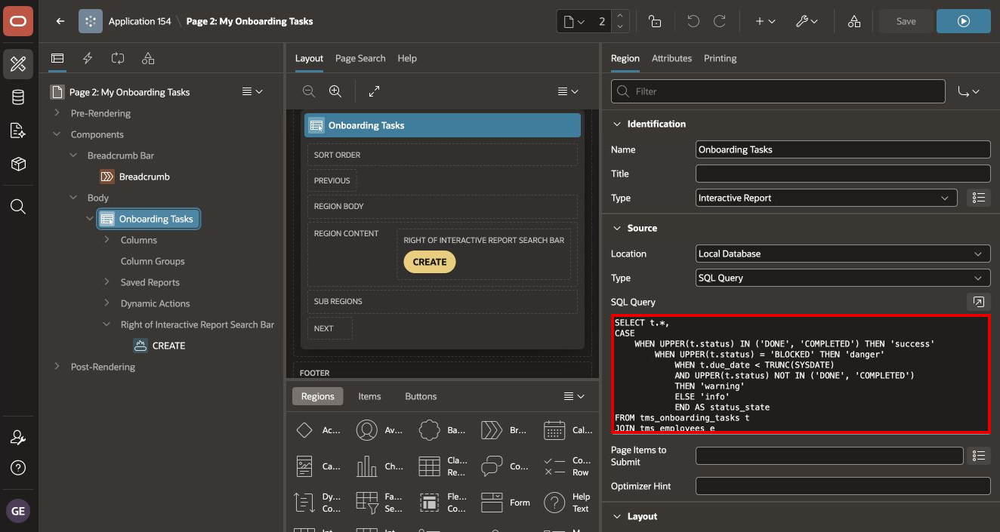

The `CASE` expression separates business meaning from presentation. The query determines the state, while Universal Theme determines the correct colors for the active light or dark theme.

> **Troubleshooting:** If the report displays no rows, verify that the current APEX username matches a `TMS_EMPLOYEES.EMAIL` value.

## Task 3: Hide the Helper Column

1. In the Rendering tree, expand **Onboarding Tasks > Columns**.

2. Select **STATUS_STATE**.

    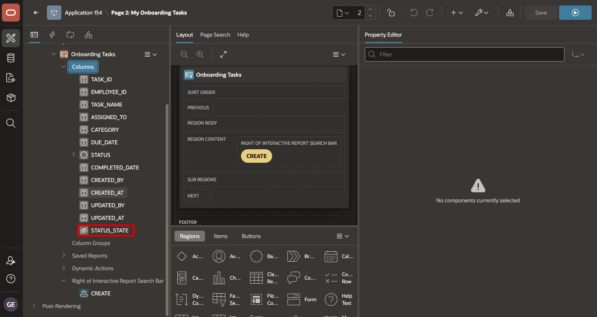

3. In **Identification**, set **Type** to **Hidden**.

    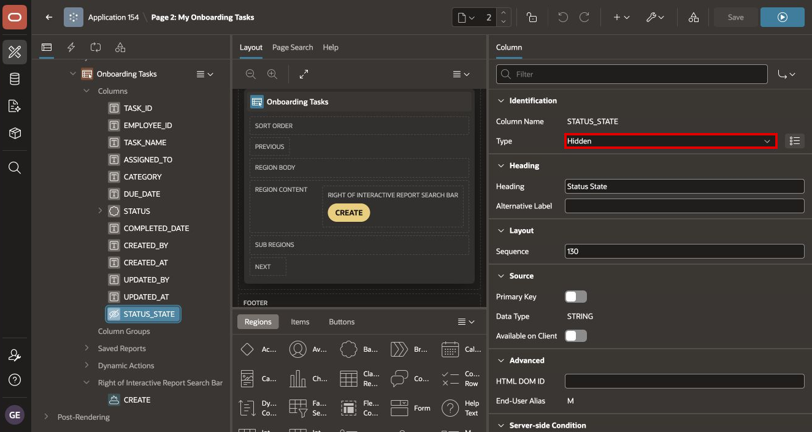

`STATUS_STATE` is required to style the badge, but it is an implementation detail that should not appear as a separate report column.

## Task 4: Configure the Status Badge

1. In the Rendering tree, select **STATUS**.

    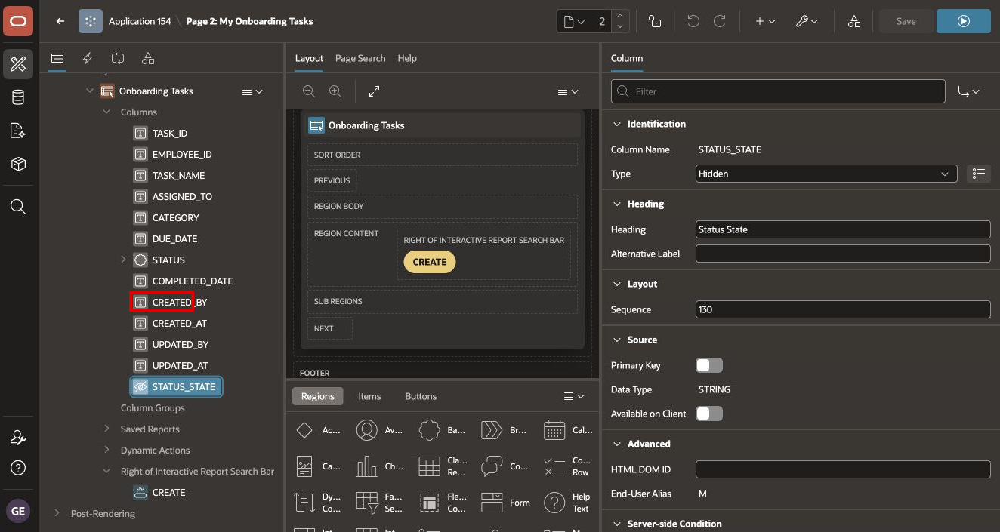

2. Under **Identification**, set **Type** to **Badge**.

    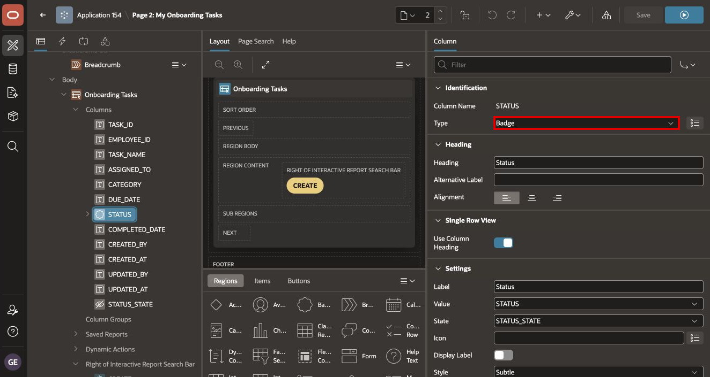

3. Under **Heading**, set **Heading** to `Status`.

4. Under **Settings**, configure:

    | Property | Value |
    | --- | --- |
    | Label | `Status` |
    | Value | `STATUS` |
    | State | `STATUS_STATE` |
    | Display Label | Off |
    | Style | `Subtle` |

    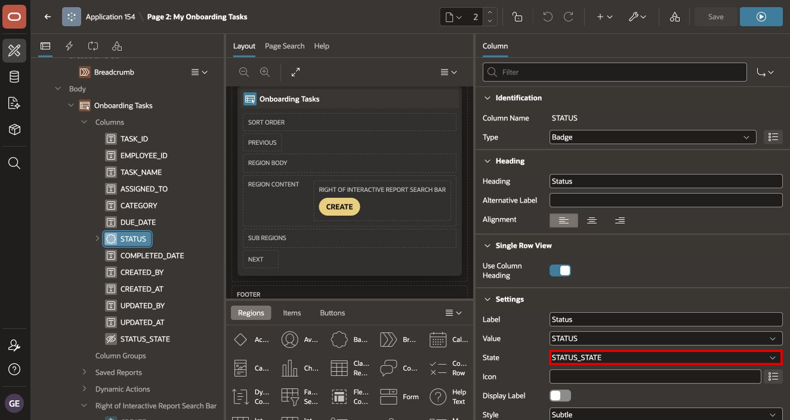

    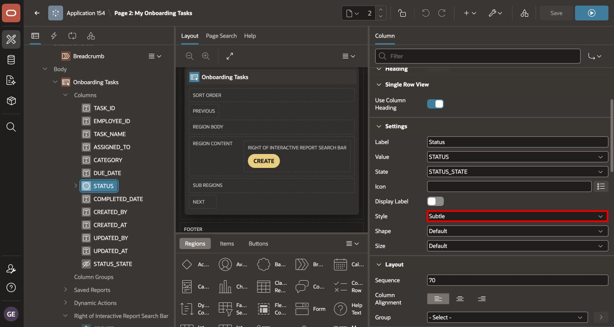

5. Keep the status text visible. The text communicates meaning even when a user cannot distinguish the badge colors.

6. Select **Save and Run Page**.

    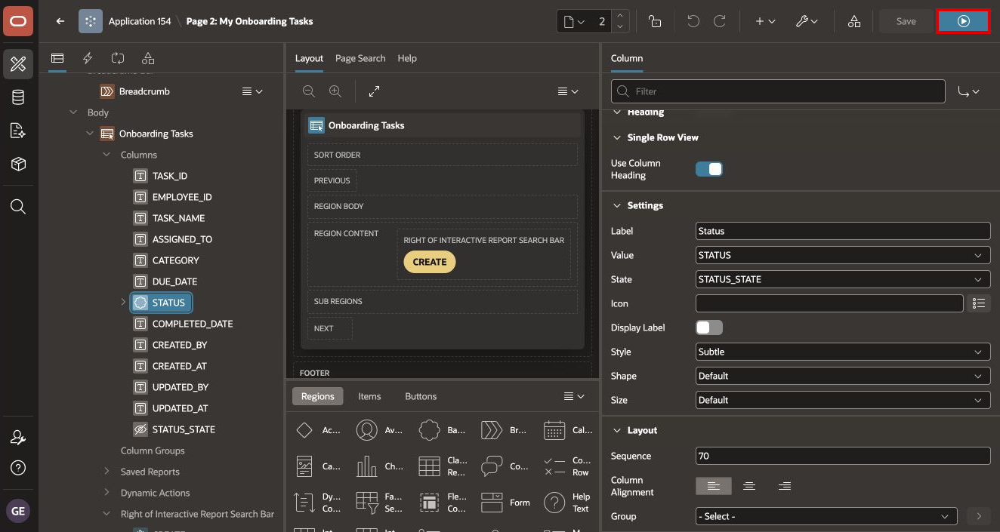

7. Sign in if prompted. Confirm that:

    - Each task displays a text badge in the Status column.
    - Completed, blocked, overdue, and other tasks use different semantic states.
    - The report remains readable in both ESS Light and ESS Dark.

    A blank report is valid when the signed-in user has no matching employee or onboarding-task rows. The badge configuration can still be verified in Page Designer.

## Summary

You converted My Onboarding Tasks to an Interactive Report and added accessible, theme-aware status badges without custom hard-coded colors.

You may now **proceed to the next lab**.

## Acknowledgements

- **Author** - Shanmukh Kornana
- **Last Updated By/Date** - Shanmukh Kornana, August 2026
