# Build the ESS Home Metric Cards

## Introduction

The ESS Home page currently contains a placeholder onboarding region. You will replace it with four live Metric Cards so that an employee can understand their current onboarding and leave position without opening another page.

Estimated Lab Time: 4 minutes

### Where We Are

ESS has named light and dark theme styles, and onboarding task statuses now use semantic badges. The Home page still needs useful, user-specific data.

### Objectives

In this lab, you will:

- Personalize the Home-page title with `APP_USER`.
- Replace the placeholder with a Metric Card region.
- Return four KPI rows from one SQL query.
- Map query columns to Metric Card text and avatar properties.
- Remove the obsolete Page Navigation placeholder.

## Task 1: Personalize the Home Banner

1. In App Builder, open **15_03: Employee Self-Service Portal** (**App 155**).

2. In the Pages report, select **Home**.

    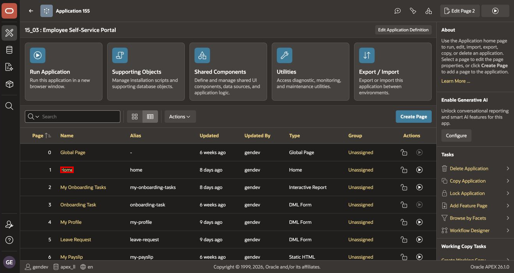

3. In Page Designer, under **Rendering > Breadcrumb Bar**, select the existing breadcrumb or title region. In the reference application, its name is **Employee Self-Service Portal**.

    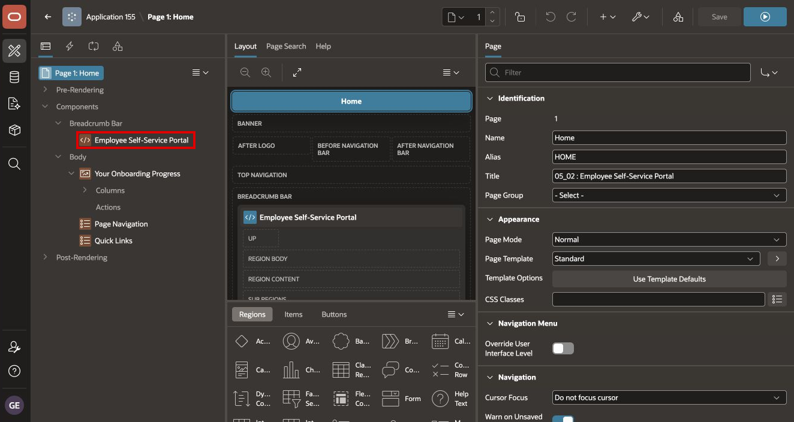

4. In **Identification**, set **Title** to:

    ```text
    Welcome, &APP_USER.
    ```

    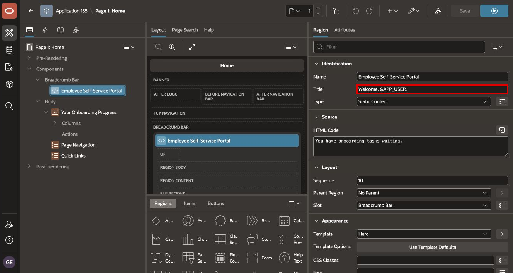

The terminating period belongs to the APEX substitution string syntax. At runtime, `&APP_USER.` is replaced by the current username.

## Task 2: Configure the Live Metric Region

1. Under **Rendering > Body**, select **Your Onboarding Progress**.

    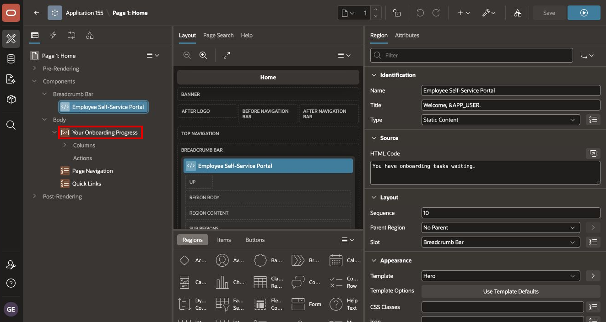

    If your application still contains a Static Content placeholder, reuse it rather than creating a duplicate region.

2. In **Identification**, configure:

    - **Name**: `Your Onboarding Progress`
    - **Type**: `Metric Card`

    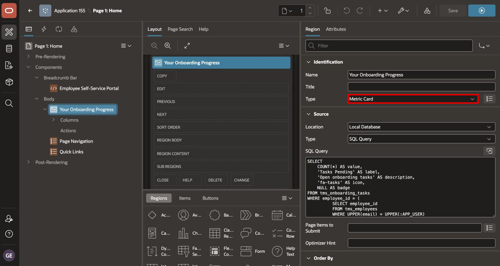

3. Under **Source**, configure:

    - **Location**: Local Database
    - **Type**: SQL Query

4. Replace the SQL Query with the following code:

    ```sql
    SELECT
        COUNT(*) AS value,
        'Tasks Pending' AS label,
        'Open onboarding tasks' AS description,
        'fa-tasks' AS icon,
        NULL AS badge
    FROM tms_onboarding_tasks
    WHERE employee_id = (
              SELECT employee_id
              FROM tms_employees
              WHERE UPPER(email) = UPPER(:APP_USER)
          )
      AND status NOT IN ('Completed', 'Cancelled')

    UNION ALL

    SELECT
        COUNT(*) AS value,
        'HR Documents Completed' AS label,
        'Completed HR document tasks' AS description,
        'fa-file-check' AS icon,
        NULL AS badge
    FROM tms_onboarding_tasks
    WHERE employee_id = (
              SELECT employee_id
              FROM tms_employees
              WHERE UPPER(email) = UPPER(:APP_USER)
          )
      AND status = 'Completed'
      AND category = 'HR Documents'

    UNION ALL

    SELECT
        NVL(
            (
                SELECT GREATEST(
                           0,
                           TRUNC(hire_date) - TRUNC(SYSDATE)
                       )
                FROM tms_employees
                WHERE UPPER(email) = UPPER(:APP_USER)
            ),
            0
        ) AS value,
        'Days Until Start' AS label,
        'Days remaining before hire date' AS description,
        'fa-calendar' AS icon,
        NULL AS badge
    FROM dual

    UNION ALL

    SELECT
        NVL(
            (
                SELECT MAX(remaining)
                FROM tms_leave_balances
                WHERE employee_id = (
                          SELECT employee_id
                          FROM tms_employees
                          WHERE UPPER(email) = UPPER(:APP_USER)
                      )
                  AND leave_type_id = 1
                  AND year = EXTRACT(YEAR FROM SYSDATE)
            ),
            0
        ) AS value,
        'Leave Days Available' AS label,
        'Current annual leave balance' AS description,
        'fa-umbrella' AS icon,
        NULL AS badge
    FROM dual
    ```

    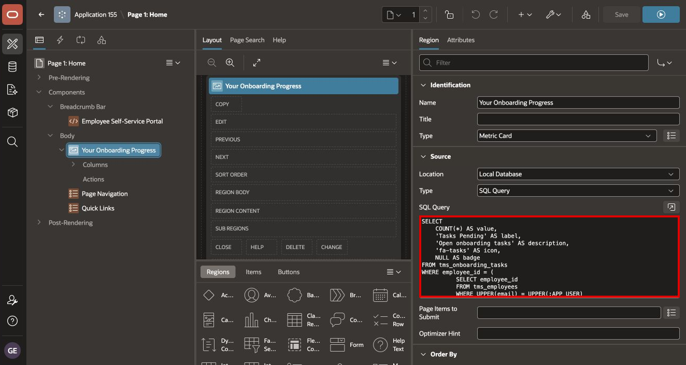

    You can also copy the query from [ess-home-metrics.sql](files/ess-home-metrics.sql).

Each `SELECT` returns the same columns, and `UNION ALL` turns the four results into four Metric Card records. The displayed numbers therefore remain live as the underlying task, employee, and leave data changes.

> **Troubleshooting:** A scalar employee lookup must return no more than one row. If it returns `ORA-01427`, remove duplicate employee email records or use the unique employee account intended for the lab.

## Task 3: Map the Metric Card Attributes

1. Select the **Attributes** tab in the Property Editor.

2. Under **Settings**, configure:

    | Property | Value |
    | --- | --- |
    | Title | `&LABEL.` |
    | Metric | `&VALUE.` |
    | Layout | `4 Columns` |

    The title displays the business label; the metric displays the number. Do not set both properties to `&LABEL.`.

    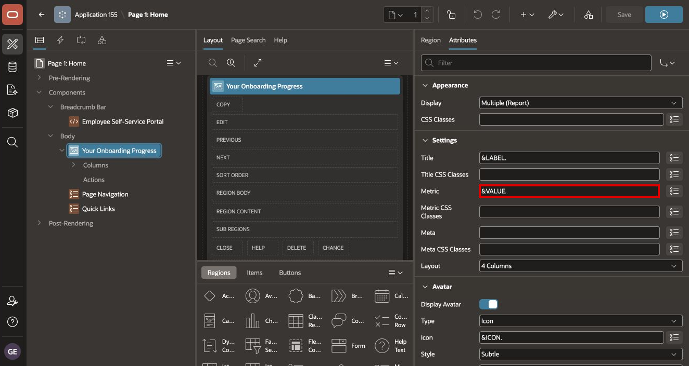

    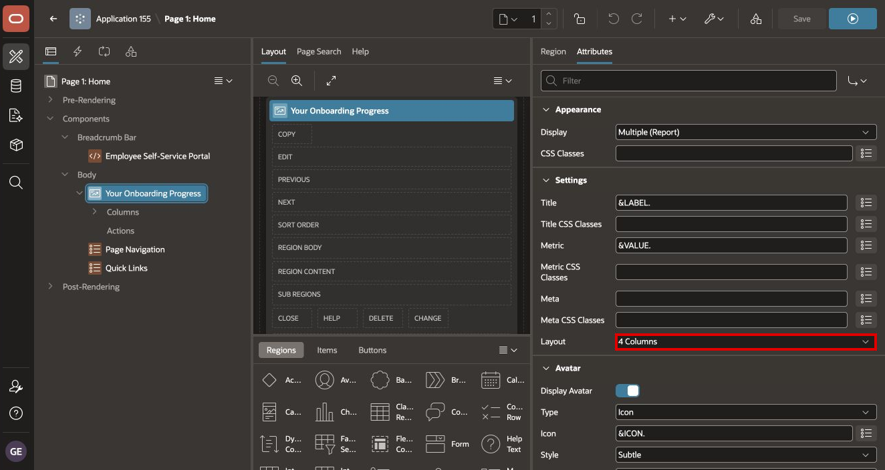

3. Under **Avatar**, configure:

    | Property | Value |
    | --- | --- |
    | Display Avatar | On |
    | Type | `Icon` |
    | Icon | `&ICON.` |
    | Style | `Subtle` |
    | Position | `Inline` |

    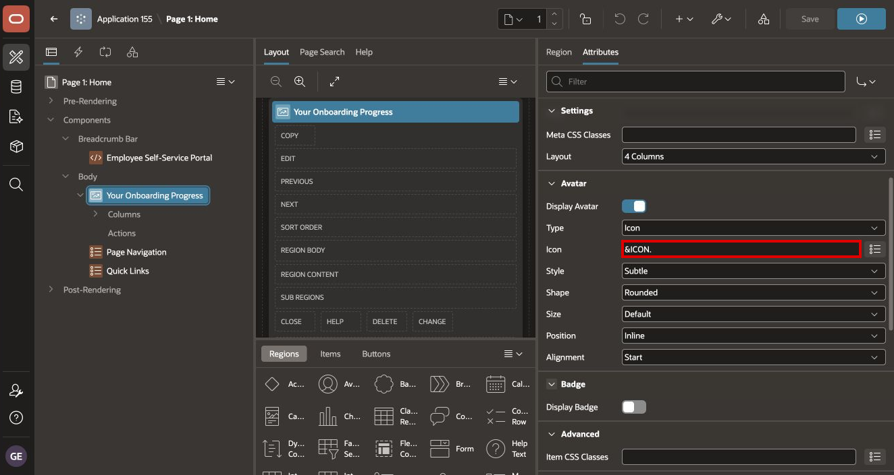

4. Select **Save and Run Page**.

    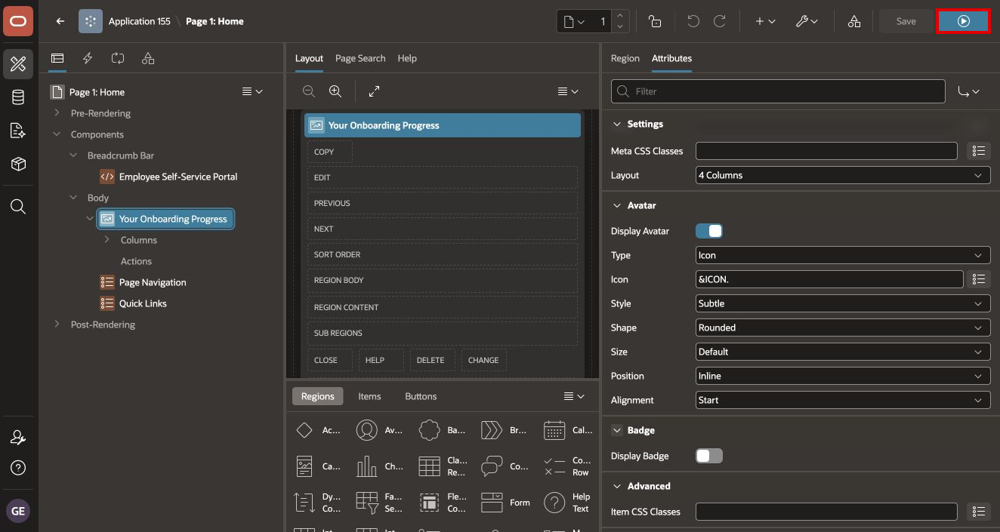

5. Sign in if prompted. Confirm that the Home page displays four cards and that each card has a label, a number, and an icon.

    If the current user has no matching employee data, the expected metric values are zero. If the whole region is empty, review the SQL for a copied semicolon, an invalid icon alias, or a scalar subquery returning multiple employees.

## Task 4: Remove the Obsolete Page Navigation Region

The KPI region replaces the old placeholder navigation content from the earlier module.

1. Return to Page Designer.

2. In the Rendering tree, right-click **Page Navigation**.

3. Select **Delete**.

    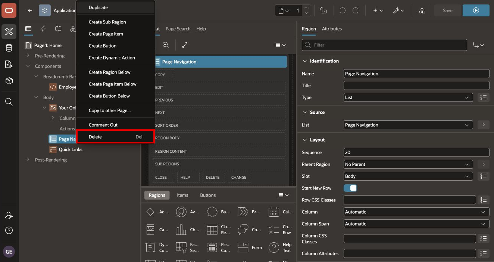

4. If **Quick Links** is still used elsewhere on the page, keep it. Delete only the region named **Page Navigation**.

5. Save the page.

## Summary

You personalized ESS Home, replaced its placeholder with four live Metric Cards, mapped numeric and icon values correctly, and removed obsolete navigation content.

You may now **proceed to the next lab**.

## Acknowledgements

- **Author** - Shanmukh Kornana
- **Last Updated By/Date** - Shanmukh Kornana, August 2026
