# Build the Onboarding Progress Template Component

## Introduction

A Template Component packages HTML, substitution attributes, CSS, and accessibility semantics into one reusable APEX component. In this lab, you will create an **Onboarding Progress Bar** and place it beneath the ESS Home banner.

Estimated Lab Time: 3 minutes

### Where We Are

ESS Home now shows four live KPI cards. Employees also need a single progress indicator that answers two questions: what percentage of onboarding is complete, and how many tasks are complete?

### Objectives

In this lab, you will:

- Create a Single Partial Template Component plug-in.
- Define three custom component attributes.
- Add accessible HTML and component CSS.
- Register the CSS file so that APEX loads it at runtime.
- Add the component to ESS Home and map SQL columns to its attributes.

## Task 1: Create the Template Component

1. In App Builder, open **15_04: Employee Self-Service Portal** (**App 157**), and then select **Shared Components**.

2. Under **User Interface**, select **Templates**.

    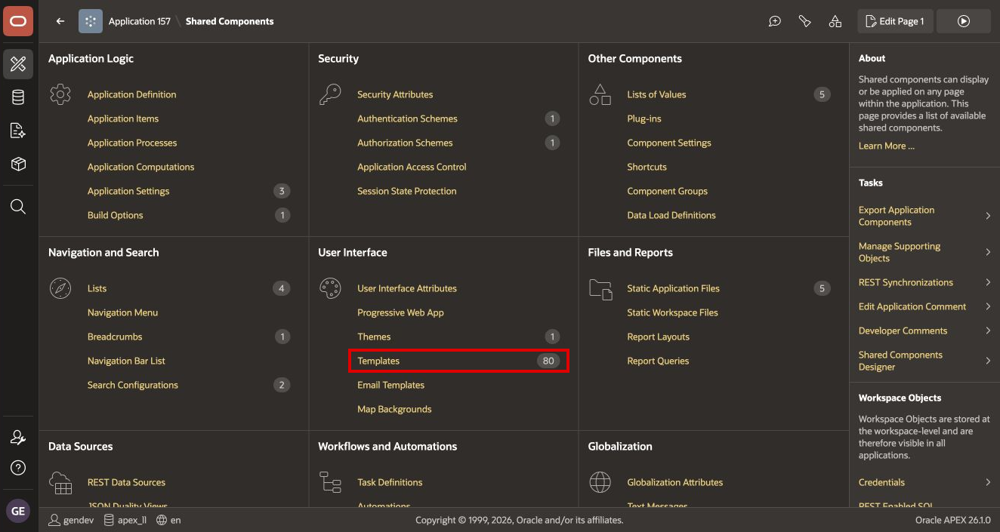

3. Select **Create**.

    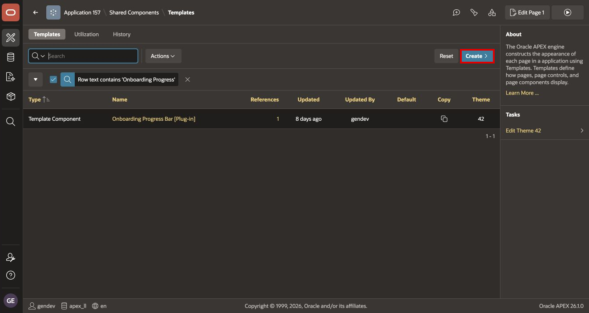

4. For **Template Type**, select **Template Component Plug-in**, and then select **Next**.

    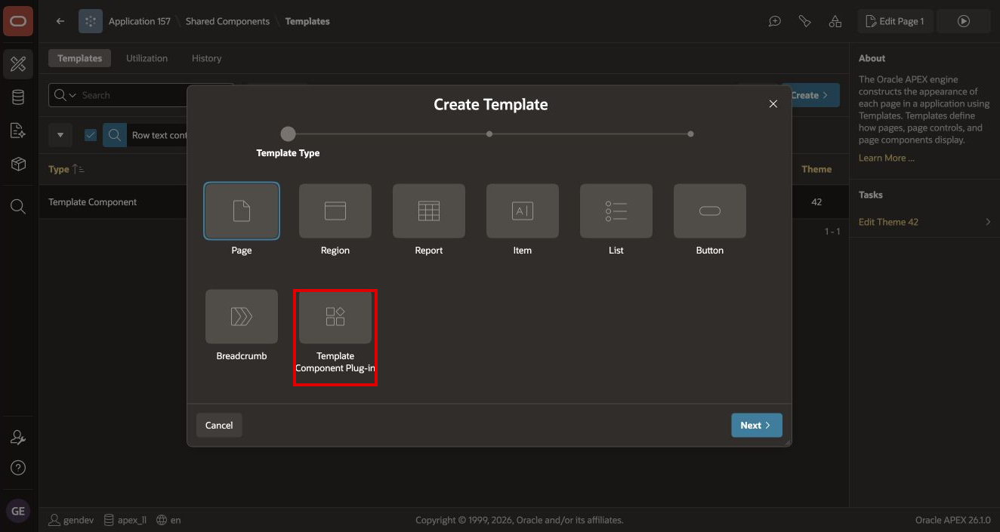

5. Choose the option to create the component **From Scratch** if APEX asks for a creation method.

6. Configure the component name:

    - **Name**: `Onboarding Progress Bar`
    - **Internal Name**: `ONBOARDING_PROGRESS_BAR`

    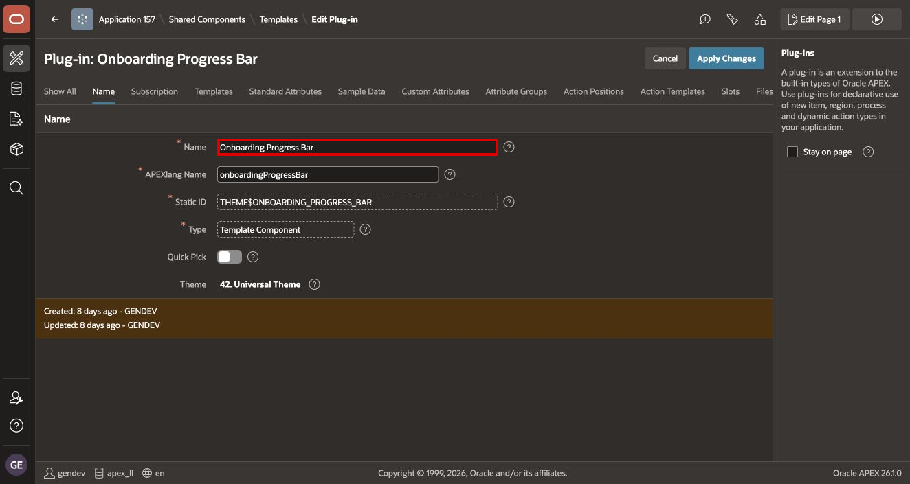

    APEX may display the stored Static ID as `THEME$ONBOARDING_PROGRESS_BAR`. The `THEME$` prefix is normal for a theme-level Template Component.

7. Select **Create Template Component**.

## Task 2: Add the Partial HTML and Custom Attributes

1. On the component edit page, select **Templates**.

2. Under **Available as**, select **Single (Partial)**. Leave **Multiple (Report)** cleared.

    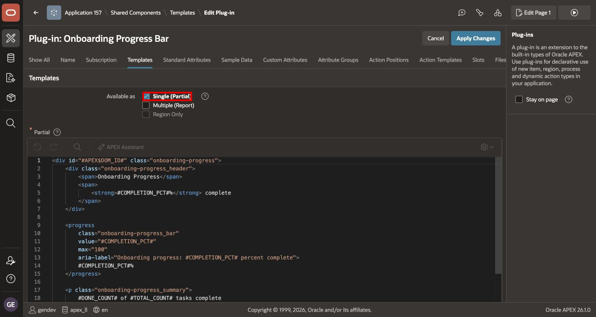

3. In **Partial**, enter the following HTML:

    ```html
    <div id="#APEX$DOM_ID#" class="onboarding-progress">
        <div class="onboarding-progress__header">
            <span>Onboarding Progress</span>
            <span>
                <strong>#COMPLETION_PCT#%</strong> complete
            </span>
        </div>

        <progress
            class="onboarding-progress__bar"
            value="#COMPLETION_PCT#"
            max="100"
            aria-label="Onboarding progress: #COMPLETION_PCT# percent complete">
            #COMPLETION_PCT#%
        </progress>

        <p class="onboarding-progress__summary">
            #DONE_COUNT# of #TOTAL_COUNT# tasks complete
        </p>
    </div>
    ```

    The double underscores in `onboarding-progress__header`, `onboarding-progress__bar`, and `onboarding-progress__summary` are intentional. They must match the CSS selectors exactly.

4. Select **Custom Attributes**.

5. Add these Component-scope Text attributes in the listed sequence:

    | Label | Static ID | Sequence | Required |
    | --- | --- | ---: | --- |
    | Completion Pct | `COMPLETION_PCT` | 10 | No |
    | Done Count | `DONE_COUNT` | 20 | No |
    | Total Count | `TOTAL_COUNT` | 30 | No |

    If the HTML has already been entered, you can select **Synchronize from Templates** and then verify the generated labels, Static IDs, scope, and sequence.

    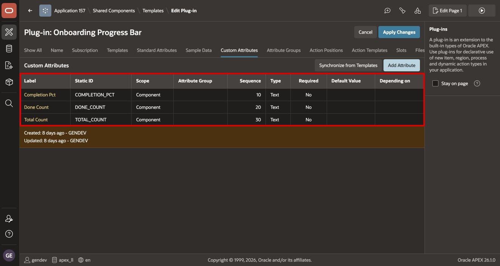

## Task 3: Create and Register the CSS File

1. Select **Files**, and then select **Create File**.

2. For **File Name**, enter `onboarding-progress.css`, and create the file.

3. Enter the following CSS and save the file:

    ```css
    .onboarding-progress {
        margin-block: 0.75rem;
    }

    .onboarding-progress__header {
        display: flex;
        justify-content: space-between;
        gap: 1rem;
        margin-block-end: 0.375rem;
        font-size: 0.875rem;
    }

    .onboarding-progress__bar {
        display: block;
        width: 100%;
        height: 0.75rem;
        accent-color: var(--ut-palette-success);
    }

    .onboarding-progress__summary {
        margin-block-start: 0.375rem;
        margin-block-end: 0;
        color: var(--ut-component-text-muted-color);
        font-size: 0.75rem;
    }
    ```

    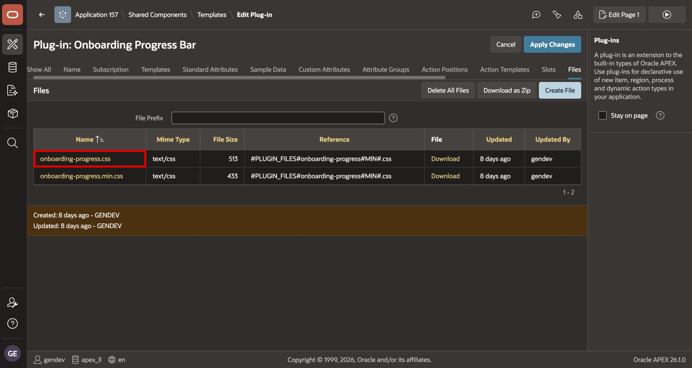

    You can also copy the stylesheet from [onboarding-progress.css](files/onboarding-progress.css).

4. Return to the component edit page and select **File URLs to Load**.

5. In **Cascading Style Sheet**, enter:

    ```text
    #PLUGIN_FILES#onboarding-progress#MIN#.css
    ```

    Creating a plug-in file does not by itself guarantee that the browser loads it. This URL tells APEX to load the normal or minified file, depending on the application's debug mode.

6. Select **Apply Changes**.

## Task 4: Add the Component to ESS Home

1. Open **Home** in Page Designer.

2. In the Rendering tree, right-click the existing Home breadcrumb or title region and select **Create Sub Region**.

3. Configure the new region:

    - **Name**: `Onboarding Progress`
    - **Type**: `Onboarding Progress Bar`
    - **Parent Region**: the Home breadcrumb or title region
    - **Slot**: `Sub Regions`

    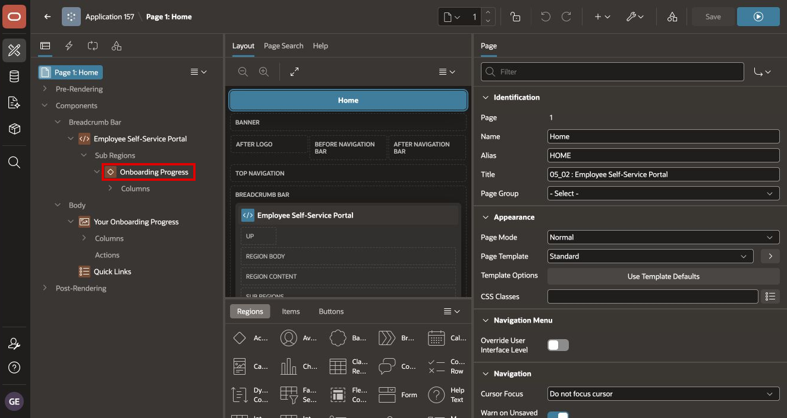

    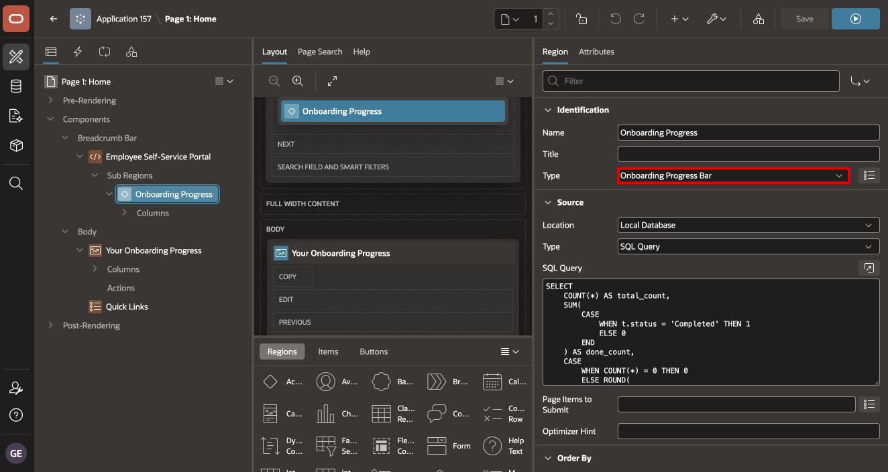

4. Under **Source**, set **Type** to **SQL Query** and enter:

    ```sql
    SELECT
        COUNT(*) AS total_count,
        NVL(
            SUM(
                CASE
                    WHEN t.status = 'Completed' THEN 1
                    ELSE 0
                END
            ),
            0
        ) AS done_count,
        CASE
            WHEN COUNT(*) = 0 THEN 0
            ELSE ROUND(
                SUM(
                    CASE
                        WHEN t.status = 'Completed' THEN 1
                        ELSE 0
                    END
                ) * 100 / COUNT(*)
            )
        END AS completion_pct
    FROM tms_onboarding_tasks t
    JOIN tms_employees e
      ON e.employee_id = t.employee_id
    WHERE UPPER(e.email) = UPPER(:APP_USER)
    ```

    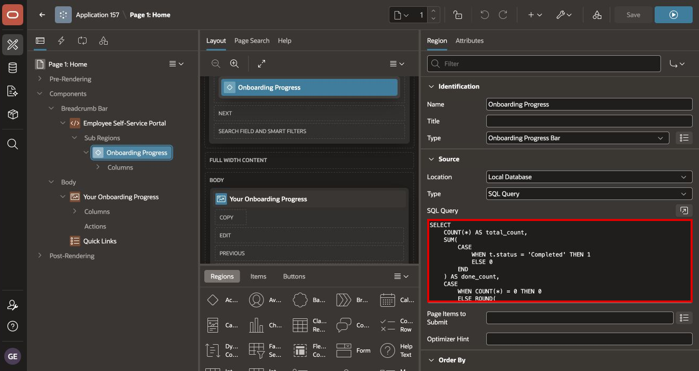

    `NVL` makes the completed count display as zero when the employee has no tasks.

5. Select the **Attributes** tab and map:

    | Template Attribute | SQL Column |
    | --- | --- |
    | Completion Pct | `&COMPLETION_PCT.` |
    | Done Count | `&DONE_COUNT.` |
    | Total Count | `&TOTAL_COUNT.` |

    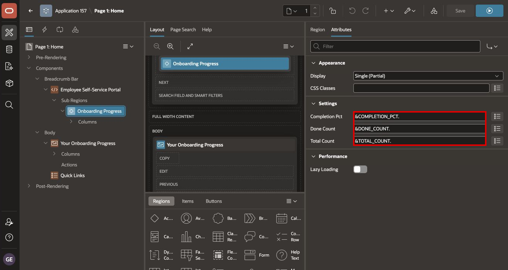

6. Save and run the page.

7. Verify that the component shows:

    - **Onboarding Progress** as visible text.
    - A percentage followed by **complete**.
    - A progress bar whose fill matches the percentage.
    - A summary in the form `n of n tasks complete`.

    If the text appears but the bar is not full width, confirm that the HTML class names use double underscores and that the CSS file is listed under **File URLs to Load**.

## Task 5: Check Accessibility

1. Inspect the rendered progress element with your browser's accessibility tools or a screen reader.

2. Confirm that its accessible name follows this pattern:

    ```text
    Onboarding progress: 50 percent complete
    ```

3. Switch between ESS Light and ESS Dark. Confirm that the visible percentage and task summary remain readable in both styles.

4. Do not remove the percentage or text summary. The bar's color and fill level must not be the only way the user receives progress information.

## Summary

You created a reusable, accessible Onboarding Progress Template Component, loaded its CSS correctly, and mapped live ESS data to its custom attributes.

You may now **proceed to the next lab**.

## Acknowledgements

- **Author** - Shanmukh Kornana
- **Last Updated By/Date** - Shanmukh Kornana, August 2026
