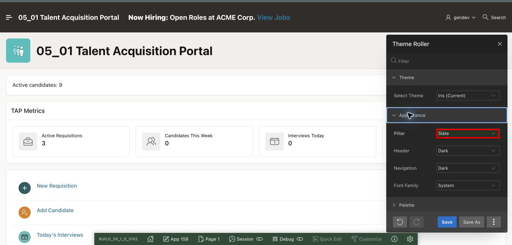
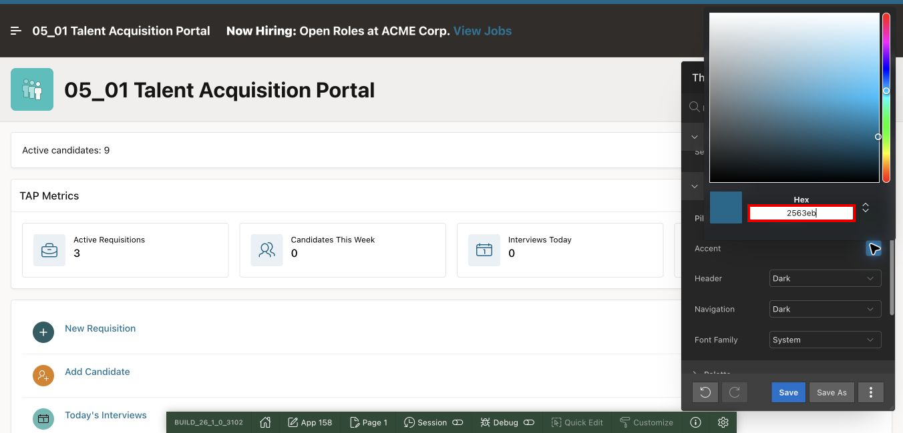
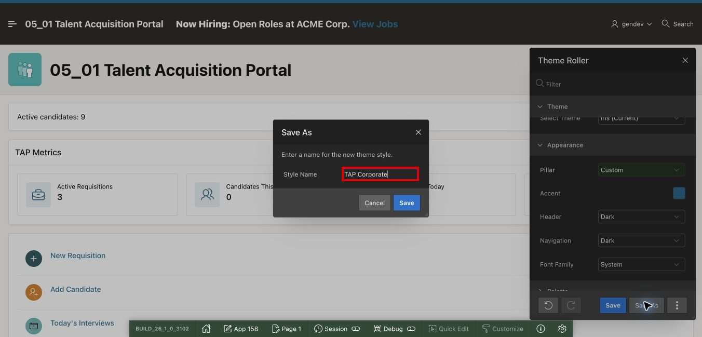
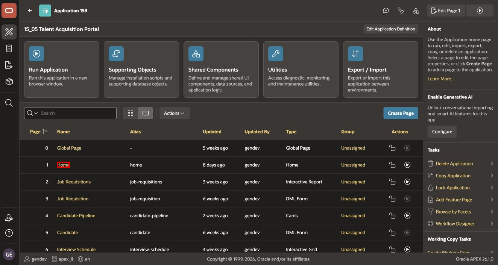
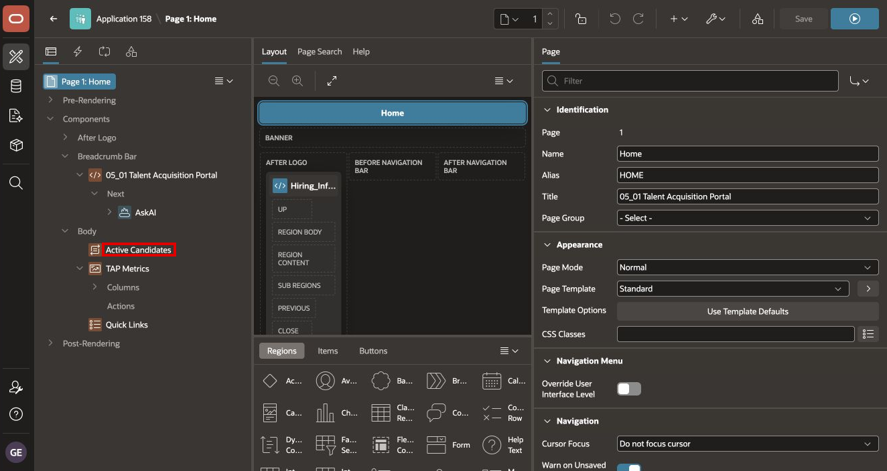
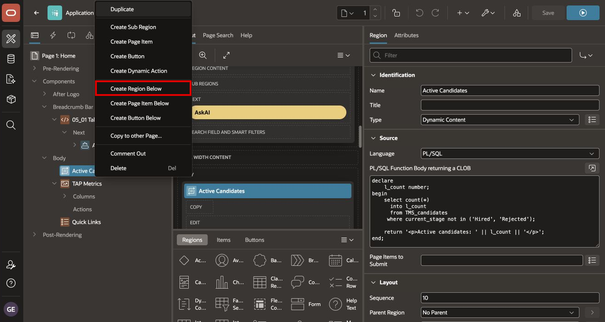
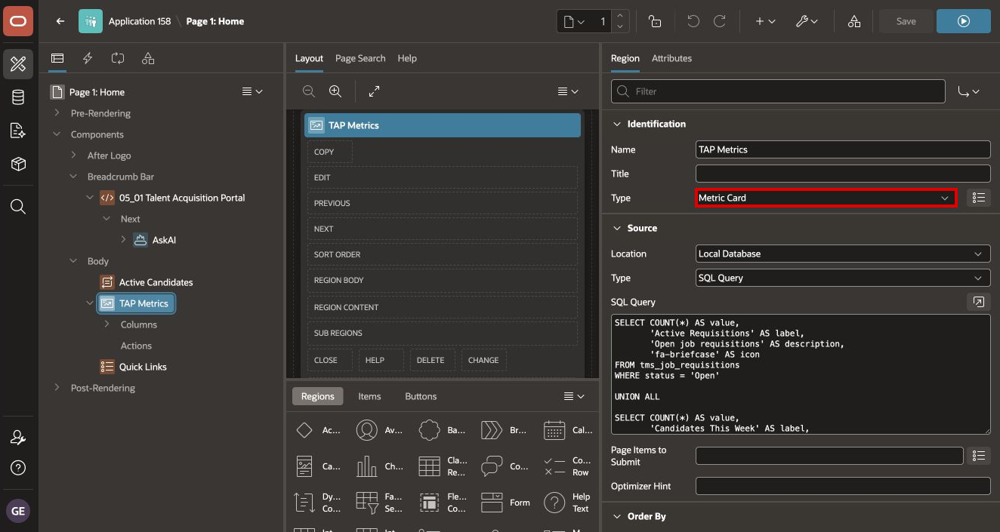
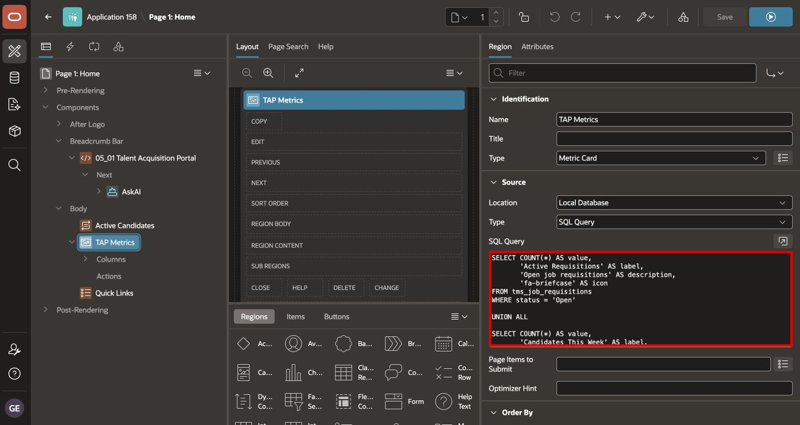
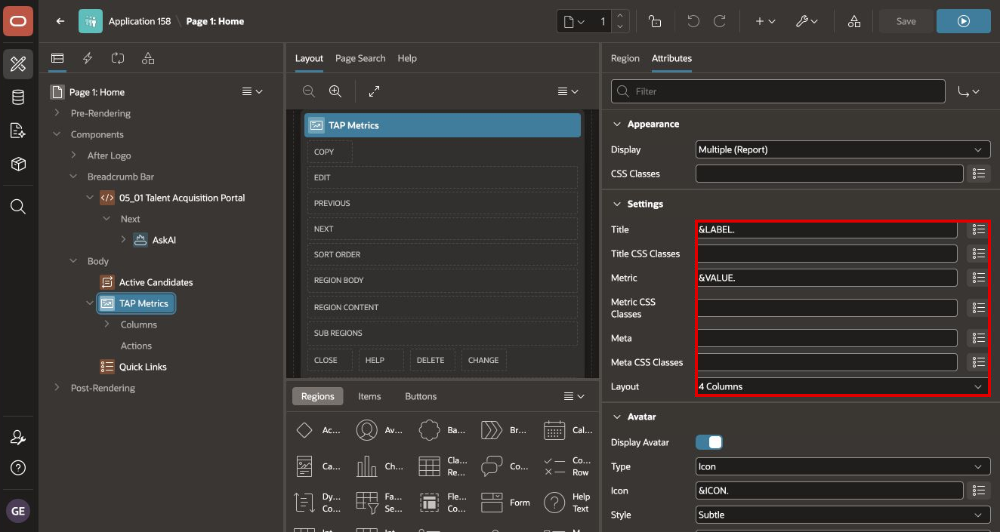
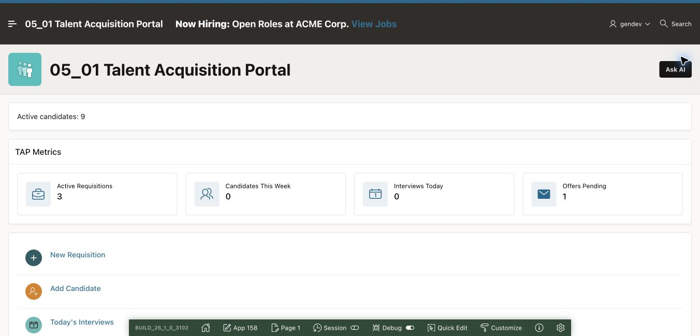

# Brand TAP and Build Recruiting Metric Cards

## Introduction

ESS now has an employee-friendly identity and live onboarding information. In this lab, you will apply the same design pattern to the Talent Acquisition Portal (TAP), but with a more formal blue and grey palette suitable for recruiters and hiring managers.

You will also add four live recruiting KPIs to TAP Home.

Estimated Lab Time: 2 minutes

### Where We Are

TAP contains the recruiting workflow and operational pages built in earlier modules. Its Home page has an Active Candidates summary but does not yet provide an at-a-glance view of requisitions, new candidates, interviews, and offers.

### Objectives

In this lab, you will:

- Create a corporate blue and grey TAP theme style.
- Add a Metric Card region beneath Active Candidates.
- Map four recruiting KPI rows to a four-column layout.
- Run and validate the completed TAP Home page.

## Task 1: Apply the TAP Corporate Theme

1. In App Builder, open **15_05: Talent Acquisition Portal** (**App 158**).

2. Run the application and sign in with the TAP credentials supplied in your workshop environment.

3. On the Developer Toolbar, select **Customize > Theme Roller**.

4. Expand **Appearance** and set **Pillar** to **Slate** to establish the corporate grey foundation.

    

5. Set **Pillar** to **Custom**, open the **Accent** color picker, and enter `2563eb` for a restrained corporate blue.

    

6. Review the page preview. APEX 26.1 applies the changes immediately; select **Refresh** only if your APEX version displays that control.

7. Select **Save As**, enter `TAP Corporate`, and select **Save**.

    

8. Close Theme Roller.

The corporate style intentionally differs from ESS: TAP uses slate and blue, while ESS uses teal and green.

## Task 2: Open TAP Home and Create the Metric Region

1. Return to App Builder and open **Home** in Page Designer.

    

2. Under **Rendering > Body**, locate **Active Candidates**.

    

3. Right-click **Active Candidates**, and select **Create Region Below**.

    

4. Configure the new region:

    - **Name**: `TAP Metrics`
    - **Type**: `Metric Card`

    

## Task 3: Add the Recruiting KPI Query

1. Under **Source**, set **Type** to **SQL Query**.

2. Enter the following SQL:

    ```sql
    SELECT COUNT(*) AS value,
           'Active Requisitions' AS label,
           'Open job requisitions' AS description,
           'fa-briefcase' AS icon
    FROM tms_job_requisitions
    WHERE status = 'Open'

    UNION ALL

    SELECT COUNT(*) AS value,
           'Candidates This Week' AS label,
           'Applications received this week' AS description,
           'fa-users' AS icon
    FROM tms_candidates
    WHERE applied_date >= TRUNC(SYSDATE, 'IW')

    UNION ALL

    SELECT COUNT(*) AS value,
           'Interviews Today' AS label,
           'Interviews scheduled today' AS description,
           'fa-calendar' AS icon
    FROM tms_interview_stages
    WHERE TRUNC(scheduled_date) = TRUNC(SYSDATE)

    UNION ALL

    SELECT COUNT(*) AS value,
           'Offers Pending' AS label,
           'Offers awaiting approval' AS description,
           'fa-envelope' AS icon
    FROM tms_offers
    WHERE status = 'Pending Approval'
    ```

    

    You can also copy the query from [tap-home-metrics.sql](files/tap-home-metrics.sql).

The four `SELECT` statements answer different recruiting questions but return the same four columns. `UNION ALL` produces the four records required by the Metric Card region.

## Task 4: Configure and Validate the Metric Cards

1. Select the **Attributes** tab.

2. Under **Settings**, configure:

    | Property | Value |
    | --- | --- |
    | Title | `&LABEL.` |
    | Metric | `&VALUE.` |
    | Layout | `4 Columns` |

    

3. Under **Avatar**, configure:

    | Property | Value |
    | --- | --- |
    | Display Avatar | On |
    | Type | `Icon` |
    | Icon | `&ICON.` |
    | Style | `Subtle` |
    | Position | `Inline` |

4. Save and run the page.

5. Confirm that TAP Home displays:

    - Active Requisitions
    - Candidates This Week
    - Interviews Today
    - Offers Pending

    

6. Confirm that the title and numeric metric are not reversed and that all four cards remain readable in the TAP Corporate style.

## Summary

You gave TAP a distinct corporate theme and added four live recruiting KPI cards to its Home page. ESS and TAP now share a consistent component pattern while retaining different visual identities for their users.

You may now **proceed to the next lab**.

## Acknowledgements

- **Author** - Shanmukh Kornana
- **Last Updated By/Date** - Shanmukh Kornana, August 2026
