# Create a CV Screening Agent in TAP

## Introduction

In this lab, you will build a CV Screening Agent for recruiters. The agent retrieves one candidate, identifies the related requisition, retrieves the job information, evaluates job-related fit, and saves a score and concise summary to the candidate record.

Estimated Time: 20 minutes

### Objectives

In this lab, you will:

- Add an `AI_SUMMARY` column to the `TMS_CANDIDATES` table.
- Create the CV Screening Agent.
- Create three On-Demand AI tools.
- Add AI Score and AI Summary to Candidate Pipeline.
- Add a protected **Screen Candidate** button.
- Open the native AI Assistant in a dialog and refresh the report after screening.

## Task 1: Prepare Candidate Data for AI Screening

1. Sign in to your Oracle APEX workspace.

2. Select **SQL Workshop**.

    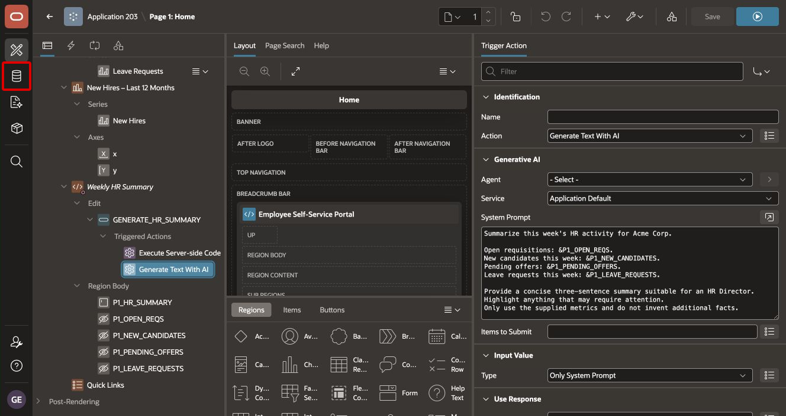

3. Select **SQL Commands**.

    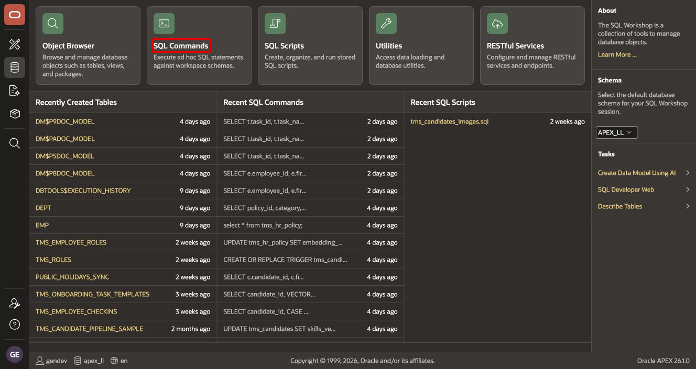

4. Enter and run the following statement:

    ```sql
    ALTER TABLE tms_candidates ADD (
        ai_summary VARCHAR2(4000)
    );
    ```

    > **Note:** If `AI_SUMMARY` already exists, do not run the statement again. Continue with the existing column.

## Task 2: Create and Configure the CV Screening Agent

1. Select **App Builder**, and open **Talent Acquisition Portal**.

2. Select **Shared Components**.

3. In **Generative AI**, select **AI Agents**.

    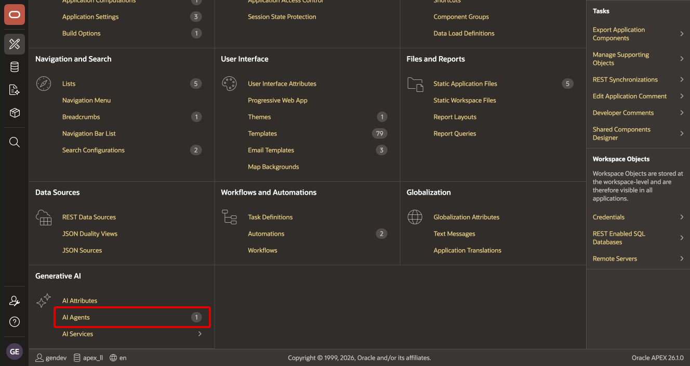

4. Select **Create**.

    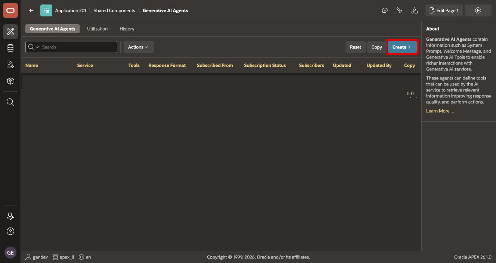

5. Configure the agent:

    | Property | Value |
    | --- | --- |
    | Name | `CV Screening Agent` |
    | Service | Application Default |
    | Response Format | Text |

6. In **System Prompt**, enter the following text:

    ```text
    You are a recruitment screening assistant for Acme Corp.

    Your purpose is to help recruiters evaluate candidates against the
    requirements of the job requisition they applied for.

    When asked to screen a candidate:
    1. Use get_candidate_information to retrieve the candidate's information.
    2. Identify the candidate's requisition.
    3. Use get_job_requirements to retrieve the corresponding job requirements.
    4. Evaluate only job-related information.

    Score the candidate from 1 to 10 based on:
    - Relevant skills
    - Relevant experience
    - Job alignment
    - Overall suitability

    Provide:
    Overall Score: <1-10>
    Recommendation: Strong Yes / Yes / Maybe / No
    Summary: <short job-related explanation>

    Do not make decisions based on name, gender, age, ethnicity,
    nationality, disability, or other protected characteristics.

    Do not invent candidate qualifications or job requirements.

    Use update_ai_score only after completing the evaluation.
    ```

7. Select **Create** or **Apply Changes** to save the agent.

## Task 3: Create the Get Candidate Information Tool

1. Open **CV Screening Agent** and locate **Tools**.

2. Select **Add Tool**.

    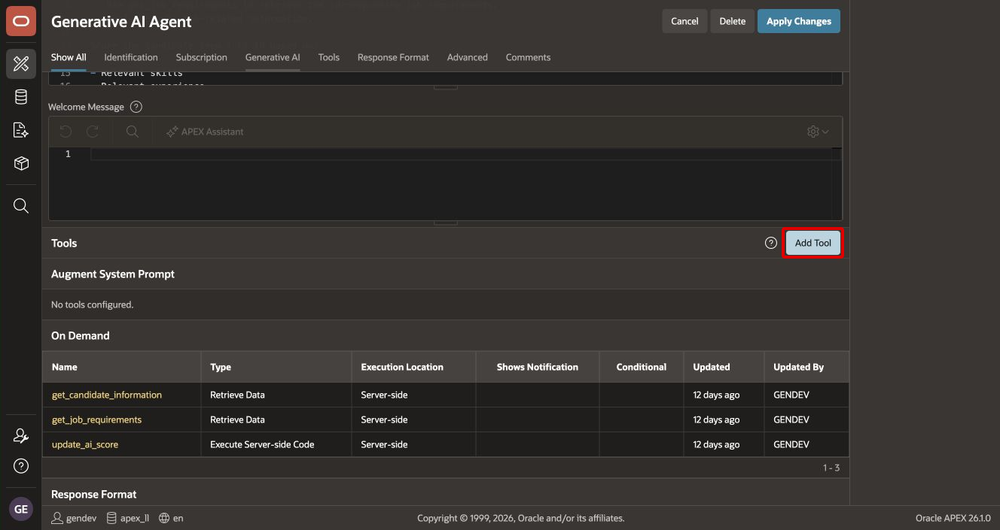

3. Configure the tool:

    | Property | Value |
    | --- | --- |
    | Name | `get_candidate_information` |
    | Type | Retrieve Data |
    | Execution | On Demand |

4. Enter this description:

    ```text
    Returns candidate information and the requisition associated with the
    candidate. Use this tool before evaluating a candidate.
    ```

5. Create a required parameter:

    | Property | Value |
    | --- | --- |
    | Name | `CANDIDATE_ID` |
    | Data Type | NUMBER |
    | Required | Yes |

6. For **Source Type**, select **SQL Query**, and enter:

    ```sql
    SELECT
        c.candidate_id,
        c.req_id,
        c.first_name || ' ' || c.last_name AS candidate_name,
        c.current_stage,
        c.source,
        c.applied_date,
        c.ai_score
    FROM tms_candidates c
    WHERE c.candidate_id = :CANDIDATE_ID
    ```

    The query must return `REQ_ID`. The next tool uses it to retrieve the related job.

7. Save the tool. Confirm that it appears under **On Demand**.

    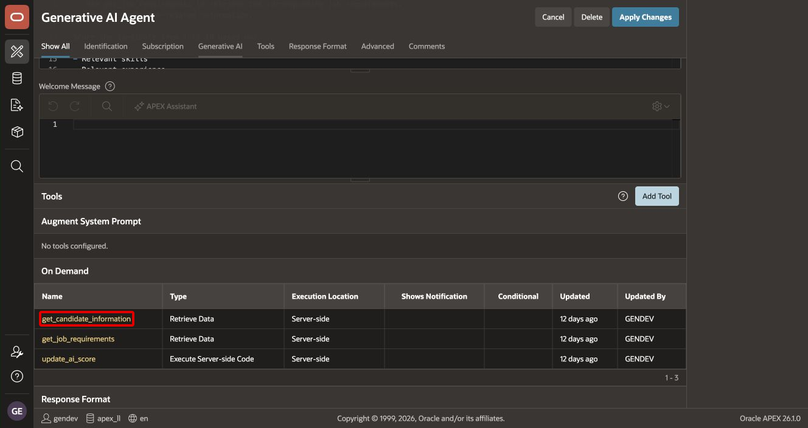

## Task 4: Create the Get Job Requirements Tool

1. Select **Add Tool** again.

2. Configure the tool:

    | Property | Value |
    | --- | --- |
    | Name | `get_job_requirements` |
    | Type | Retrieve Data |
    | Execution | On Demand |

3. Enter this description:

    ```text
    Returns the requisition and associated job information.
    Use this tool to understand the requirements of the job for which the candidate applied.
    ```

4. Create a required parameter:

    | Property | Value |
    | --- | --- |
    | Name | `REQ_ID` |
    | Data Type | NUMBER |
    | Required | Yes |

5. For **Source Type**, select **SQL Query**, and enter:

    ```sql
    SELECT
        r.req_id,
        r.job_id,
        j.title AS job_title,
        r.status AS requisition_status,
        d.name AS department_name
    FROM tms_job_requisitions r
    JOIN tms_jobs j
      ON j.job_id = r.job_id
    LEFT JOIN tms_departments d
      ON d.dept_id = r.dept_id
    WHERE r.req_id = :REQ_ID
    ```

6. Save the tool.

    

The two retrieval tools now follow this relationship:

```text
TMS_CANDIDATES.REQ_ID
        ↓
TMS_JOB_REQUISITIONS.REQ_ID
        ↓
TMS_JOBS.JOB_ID
```

## Task 5: Create the Update AI Screening Results Tool

1. Select **Add Tool**.

2. Configure the tool:

    | Property | Value |
    | --- | --- |
    | Name | `update_ai_score` |
    | Type | Execute Server-side Code |
    | Execution | On Demand |

3. Enter this description:

    ```text
    Stores the completed AI screening score and summary for a candidate.
    Call this only after evaluating the candidate against their job.
    ```

4. Create these required parameters:

    | Name | Data Type | Required |
    | --- | --- | --- |
    | `CANDIDATE_ID` | NUMBER | Yes |
    | `SCORE` | NUMBER | Yes |
    | `SUMMARY` | VARCHAR2 | Yes |

5. Enter this PL/SQL code:

    ```plsql
    BEGIN
        IF :SCORE < 1 OR :SCORE > 10 THEN
            RAISE_APPLICATION_ERROR(
                -20001,
                'AI score must be between 1 and 10.'
            );
        END IF;

        UPDATE tms_candidates
           SET ai_score   = :SCORE,
               ai_summary = :SUMMARY,
               updated_by = :APP_USER,
               updated_at = SYSTIMESTAMP
         WHERE candidate_id = :CANDIDATE_ID;

        IF SQL%ROWCOUNT = 0 THEN
            RAISE_APPLICATION_ERROR(
                -20002,
                'Candidate could not be found.'
            );
        END IF;
    END;
    ```

    The validation rejects an out-of-range score. The row-count check prevents the tool from reporting success for a missing candidate.

6. Save the tool.

    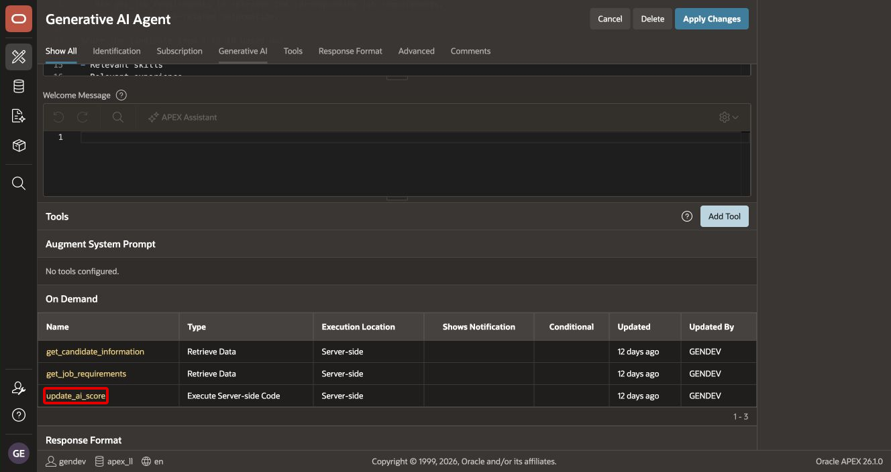

7. Return to the agent and verify that all three tools appear under **On Demand**.

## Task 6: Display AI Screening Results in Candidate Pipeline

1. Return to the TAP application home page.

2. Open **Page 4: Candidate Pipeline**.

    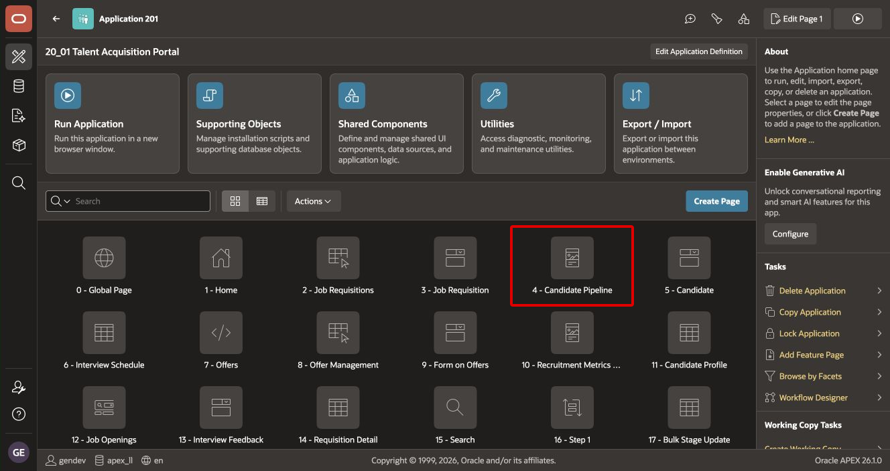

3. In the Rendering tree, select the **Candidates** Interactive Report region.

4. Open **Source**, and add the two columns to the existing query. Keep the existing table alias when the query uses one.

    ```sql
    c.ai_score,
    c.ai_summary
    ```

    Add the expressions before the query's `FROM` clause and preserve the comma between select-list expressions.

5. Save the page. APEX synchronizes the report columns with the query.

6. Expand **Candidates > Columns**, and select **AI_SCORE**.

    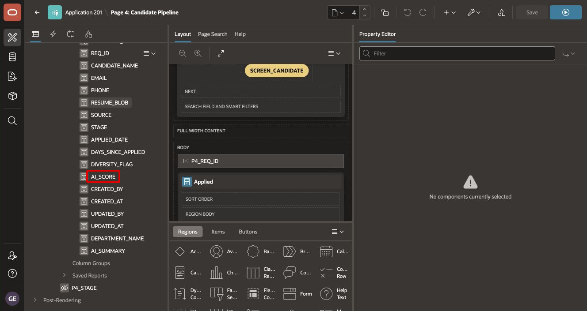

7. Set **Heading** to `AI Score`. Keep **Enable Sort** set to **Yes**.

8. Select **AI_SUMMARY**.

    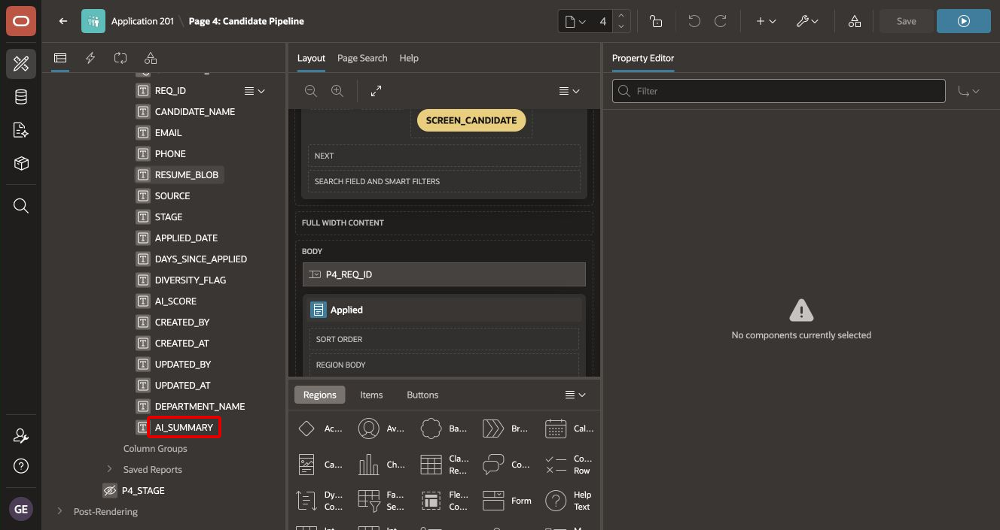

9. Set **Heading** to `AI Summary`.

10. Save the page.

## Task 7: Save the Candidate Pipeline Default Report Layout

1. Run TAP and open **Candidate Pipeline**.

2. In the Interactive Report, select **Actions > Columns**.

3. Move **AI Score** and **AI Summary** to **Display in Report**. Position both columns near the candidate identity and stage columns.

4. Select **Apply**.

5. Select **Actions > Report > Save Report**.

6. Choose **Save as Default Report Settings**, and save the report as the application's primary default.

    > **Note:** Saving only a personal report does not change the layout for other users. Save the application default while signed in as a developer who can manage the default report.

7. Confirm that both AI columns remain visible after the report reloads.

## Task 8: Add the Screen Candidate Button

1. Return to Page Designer for **Page 4: Candidate Pipeline**.

2. In the Rendering tree, select the existing **Breadcrumb** region.

3. Create a button under the region, and configure it:

    | Property | Value |
    | --- | --- |
    | Button Name | `SCREEN_CANDIDATE` |
    | Label | `Screen Candidate` |
    | Position | Create |
    | Icon | `fa-sparkles` |
    | Action | Defined by Dynamic Action |

    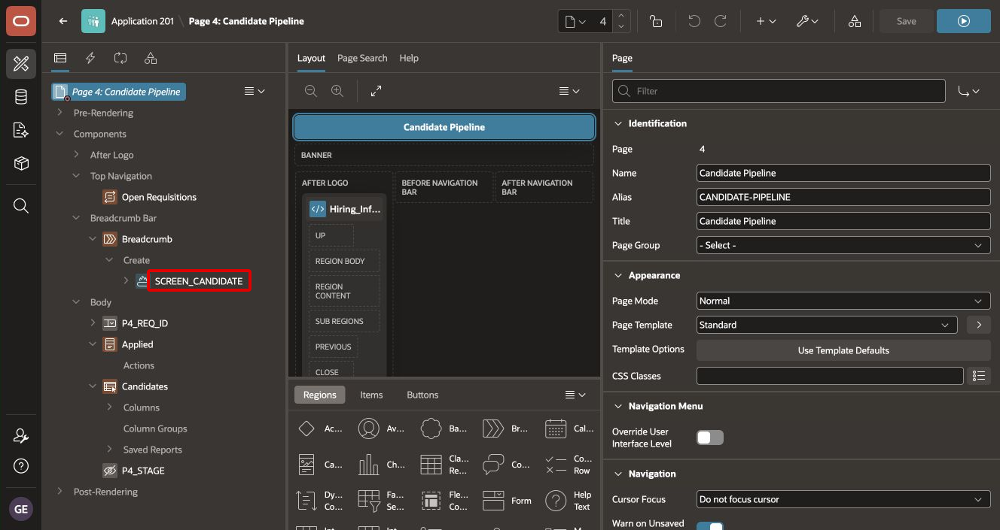

4. Verify the button label and appearance properties.

    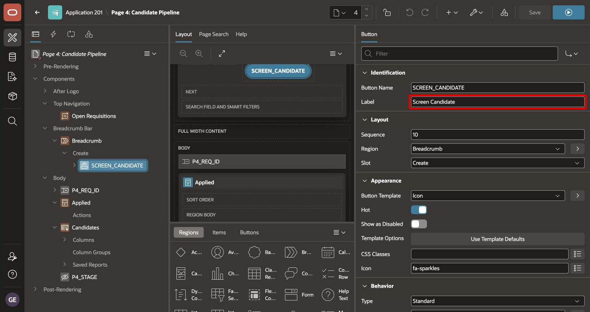

5. Under **Security**, set **Authorization Scheme** to the existing **TA Admin** authorization scheme.

    This restriction prevents unauthorized recruiting users from invoking a tool that updates candidate records.

## Task 9: Connect the Button to the CV Screening Agent

1. Select the **SCREEN_CANDIDATE** button. Expand **Triggered Actions**.

2. Create a True Action named `Screen Candidate with AI`.

3. Configure the action:

    | Property | Value |
    | --- | --- |
    | Action | Show AI Assistant |
    | AI Agent | CV Screening Agent |
    | Display | Dialog |
    | Dialog Title | Candidate Screening |

    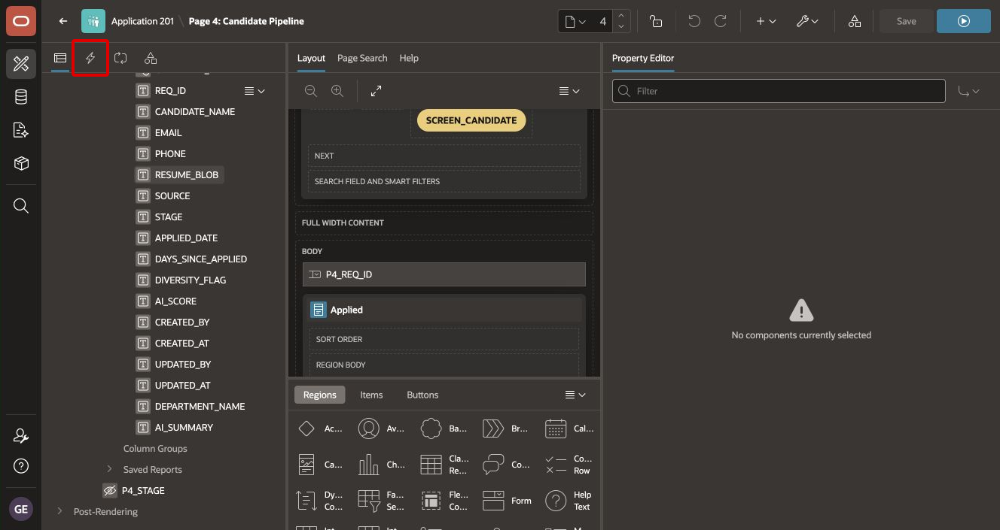

    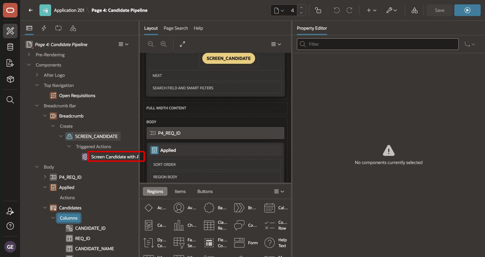

4. Add a following True Action for each Candidate Pipeline region that must show the updated score:

    | Property | Value |
    | --- | --- |
    | Action | Refresh |
    | Selection Type | Region |
    | Region | Candidates |

5. Save the page.

    > **Important:** The supplied Candidate Pipeline does not define a selected-row candidate page item. Pass the candidate ID in the assistant prompt, as shown in Task 10. If your implementation adds a selected candidate item, include that item value in the assistant context.

## Task 10: Test Candidate Screening and Verify the Results

1. Return to the TAP application home page and select **Run Application**.

    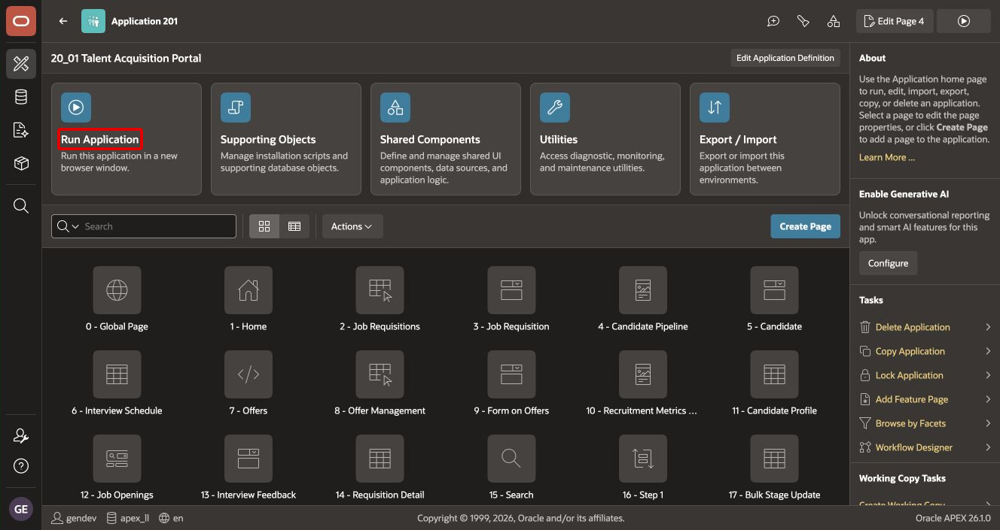

2. Sign in as a user who satisfies the TA Admin authorization scheme.

3. Open **Candidate Pipeline** and note the current values for candidate `101`.

4. Select **Screen Candidate**.

5. In the AI Assistant dialog, enter:

    ```text
    Screen candidate 101 and save the final screening score and summary to their candidate record.
    ```

6. If the assistant asks for confirmation before using `update_ai_score`, review the proposed candidate ID, score, and summary. Confirm the update only when the values are correct.

7. Close the dialog after the assistant reports that it updated the record.

8. Confirm that Candidate Pipeline refreshes and displays the new **AI Score** and **AI Summary** for candidate `101`.

The completed flow is:

```text
Candidate ID
    ↓
get_candidate_information
    ↓
get_job_requirements
    ↓
Job-related AI evaluation
    ↓
update_ai_score
    ↓
Candidate Pipeline refresh
```

> **Note:** This lab screens one candidate at a time. Treat **Screen All Candidates** as a later enhancement with separate controls, monitoring, and error handling.

## Summary

You created a CV Screening Agent with three On-Demand tools, displayed its output in Candidate Pipeline, protected the entry point, and screened one candidate through the native AI Assistant.

You may now **proceed to the next lab**.

## Acknowledgements

- **Author** - Shanmukh Kornana
- **Last Updated By/Date** - Shanmukh Kornana, August 2026
