# Create an Onboarding Assistant in ESS

## Introduction

In this lab, you will create an Onboarding Assistant for employees. The agent identifies the signed-in employee through `APP_USER`, retrieves only that employee's tasks, searches company policy text, and completes only a task owned by that employee.

Estimated Time: 20 minutes

### Objectives

In this lab, you will:

- Create the Onboarding Assistant Agent.
- Retrieve the signed-in employee's onboarding tasks.
- Search HR policy content by topic.
- Mark an owned task complete through a controlled tool.
- Add the native AI Assistant to ESS Home.
- Test the assistant with an annual leave policy question.

## Task 1: Create and Configure the Onboarding Assistant

1. In App Builder, open **20_02: Employee Self-Service Portal**.

    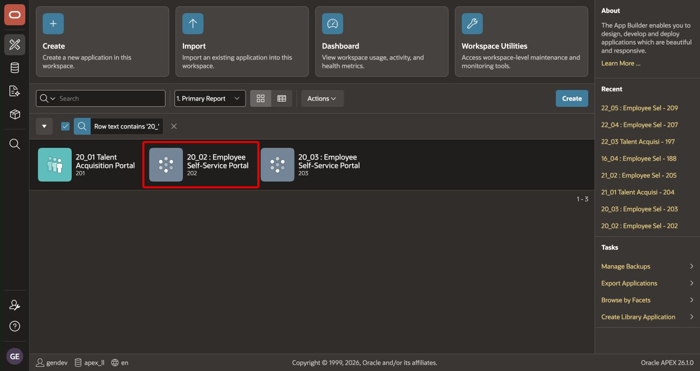

2. Select **Shared Components**.

    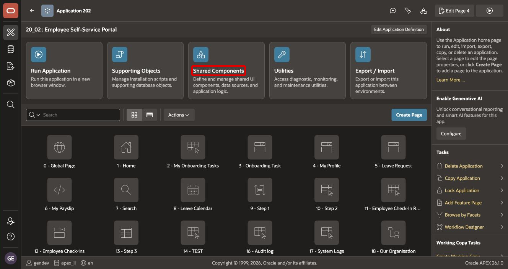

3. In **Generative AI**, select **AI Agents**.

    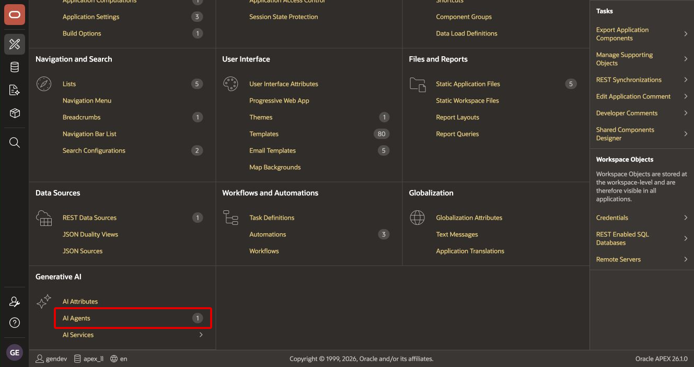

4. Select **Create**.

    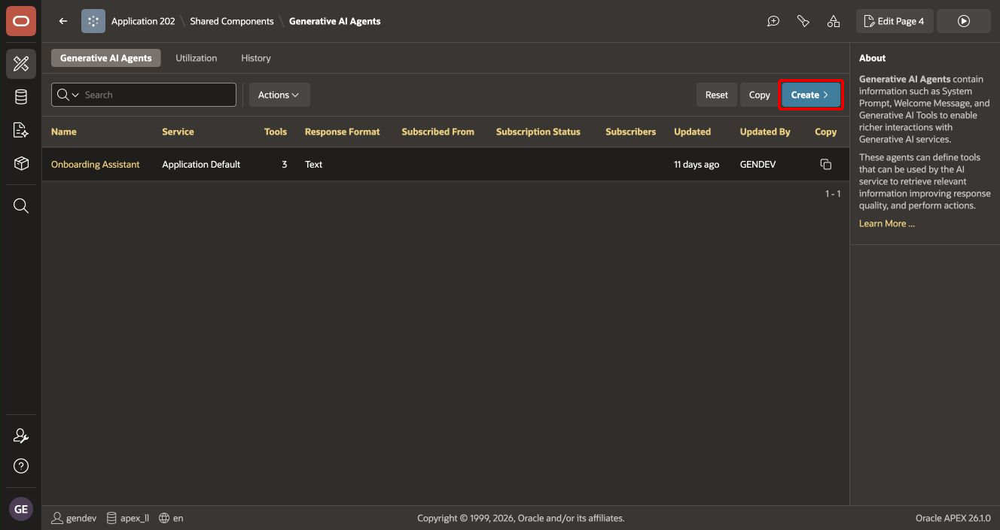

5. Configure the agent:

    | Property | Value |
    | --- | --- |
    | Name | `Onboarding Assistant` |
    | Service | Application Default |
    | Response Format | Text |

6. Enter this System Prompt:

    ```text
    You are a friendly onboarding assistant for Acme Corp's new employees.

    Help employees understand their onboarding tasks and HR policies.

    Always use the available tools to retrieve actual application data.

    When discussing onboarding tasks:
    - Retrieve the logged-in employee's actual tasks.
    - Clearly identify incomplete or overdue tasks.
    - Mention due dates when available.
    - Never invent tasks.

    When an employee asks about an HR policy:
    - Use the HR policy tool.
    - Answer only from the policy information returned by the tool.
    - Do not invent company policies.

    When an employee confirms that they completed a task:
    - Identify the appropriate task.
    - Use the available tool to mark it complete.

    Be concise, helpful and friendly.
    ```

7. Open **Advanced**. Unlock **Static ID** if required, and enter `ONBOARDING_ASSISTANT`.

    > **Note:** APEX can display an automatically generated value such as `onboarding-assistant`. Use the workshop identifier when the field is editable.

8. Save the agent.

9. Open **Onboarding Assistant** to continue.

    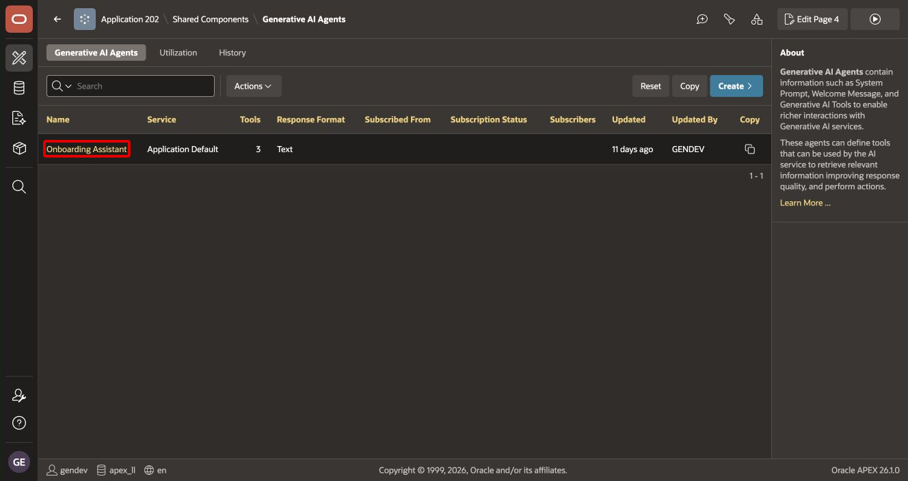

## Task 2: Create the Employee Task Retrieval Tool

1. In the agent's **Tools** section, select **Add Tool**.

    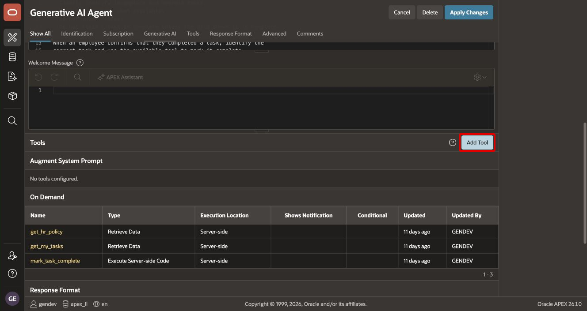

2. Configure the tool:

    | Property | Value |
    | --- | --- |
    | Name | `get_my_tasks` |
    | Type | Retrieve Data |
    | Execution | On Demand |

3. Enter this description:

    ```text
    Returns onboarding tasks belonging to the currently logged-in employee.
    Use this tool when the employee asks about their onboarding tasks,
    remaining tasks, due tasks or overdue tasks.
    ```

4. Do not create an `EMPLOYEE_ID` parameter. The query resolves the employee from `APP_USER`.

5. For **Source Type**, select **SQL Query**, and enter:

    ```sql
    SELECT
        t.task_id,
        t.task_name,
        t.category,
        t.due_date,
        t.status
    FROM tms_onboarding_tasks t
    JOIN tms_employees e
      ON e.employee_id = t.employee_id
    WHERE UPPER(e.email) = UPPER(:APP_USER)
    ORDER BY
        CASE
            WHEN t.status = 'Done' THEN 2
            ELSE 1
        END,
        t.due_date
    ```

    The filter uses the authenticated username. It does not trust an employee ID supplied by the model or browser.

6. Save the tool.

    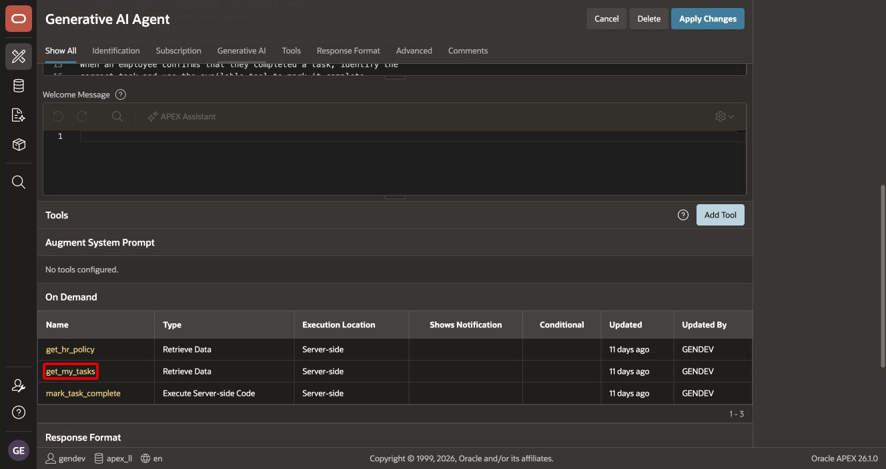

## Task 3: Create the HR Policy Search Tool

1. Select **Add Tool**.

2. Configure the tool:

    | Property | Value |
    | --- | --- |
    | Name | `get_hr_policy` |
    | Type | Retrieve Data |
    | Execution | On Demand |

3. Enter this description:

    ```text
    Searches Acme Corp HR policies for information related to a topic
    requested by the employee.

    Use this tool whenever the employee asks about an HR policy.
    ```

4. Create a parameter:

    | Property | Value |
    | --- | --- |
    | Name | `TOPIC` |
    | Data Type | VARCHAR2 |
    | Required | Yes |

5. For **Source Type**, select **SQL Query**, and enter:

    ```sql
    SELECT
        policy_id,
        category,
        title,
        content
    FROM tms_hr_policy
    WHERE UPPER(title) LIKE '%' || UPPER(:TOPIC) || '%'
       OR UPPER(category) LIKE '%' || UPPER(:TOPIC) || '%'
       OR UPPER(content) LIKE '%' || UPPER(:TOPIC) || '%'
    FETCH FIRST 3 ROWS ONLY
    ```

6. Save the tool.

    

This module uses keyword matching intentionally. `TMS_HR_POLICY.EMBEDDING_VECTOR` allows a later module to replace the query with semantic search while keeping the same tool interface.

## Task 4: Create the Task Completion Tool

1. Select **Add Tool**.

2. Configure the tool:

    | Property | Value |
    | --- | --- |
    | Name | `mark_task_complete` |
    | Type | Execute Server-side Code |
    | Execution | On Demand |

3. Enter this description:

    ```text
    Marks an onboarding task as Done when the logged-in employee confirms
    that they have completed the task.

    Only tasks belonging to the currently logged-in employee can be updated.
    ```

4. Create a parameter:

    | Property | Value |
    | --- | --- |
    | Name | `TASK_ID` |
    | Data Type | NUMBER |
    | Required | Yes |

5. Enter this PL/SQL code:

    ```plsql
    BEGIN
        UPDATE tms_onboarding_tasks t
           SET t.status = 'Done'
         WHERE t.task_id = :TASK_ID
           AND t.employee_id = (
               SELECT e.employee_id
                 FROM tms_employees e
                WHERE UPPER(e.email) = UPPER(:APP_USER)
           );

        IF SQL%ROWCOUNT = 0 THEN
            RAISE_APPLICATION_ERROR(
                -20001,
                'The onboarding task could not be updated.'
            );
        END IF;
    END;
    ```

    The ownership predicate prevents one employee from completing another employee's task. The row-count check reports a missing or unauthorized task as an error.

6. Save the tool.

    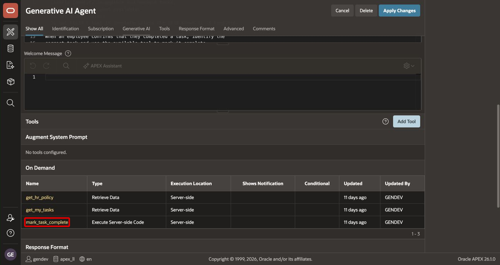

## Task 5: Verify the Onboarding Assistant Tools

1. Return to **Shared Components > AI Agents > Onboarding Assistant**.

2. Confirm that **Tools > On Demand** contains:

    ```text
    Onboarding Assistant
    ├── get_my_tasks
    ├── get_hr_policy
    └── mark_task_complete
    ```

3. Confirm that each tool is **On Demand** and uses the expected tool type.

4. Select **Apply Changes**.

## Task 6: Add the Onboarding Assistant Button to ESS Home

1. Return to the ESS application home page.

2. Open **Page 1: Home**.

    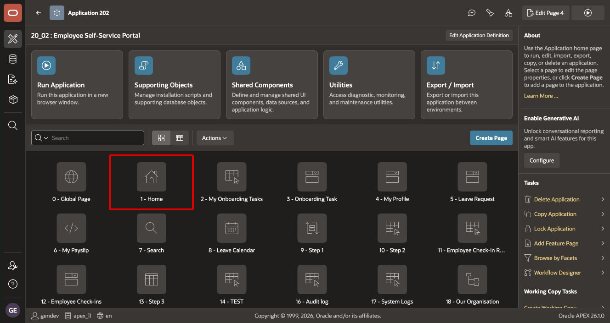

3. In the Rendering tree, select the existing **Employee Self-Service Portal** Breadcrumb region.

4. Create a button under the region.

5. Configure the button:

    | Property | Value |
    | --- | --- |
    | Button Name | `ASK_ONBOARDING_ASSISTANT` |
    | Label | `Ask Onboarding Assistant` |
    | Position | Next |
    | Icon | `fa-sparkles` |
    | Action | Defined by Dynamic Action |

    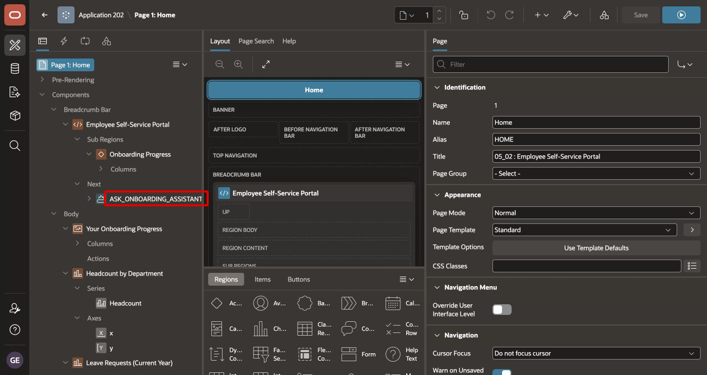

6. Save the page.

## Task 7: Connect the Button to the Onboarding Assistant

1. Select **ASK_ONBOARDING_ASSISTANT** in the Rendering tree.

2. Expand **Triggered Actions**. If no action exists, create a True Action.

3. Configure the action:

    | Property | Value |
    | --- | --- |
    | Name | `Show AI Assistant` |
    | Action | Show AI Assistant |
    | AI Agent | Onboarding Assistant |

    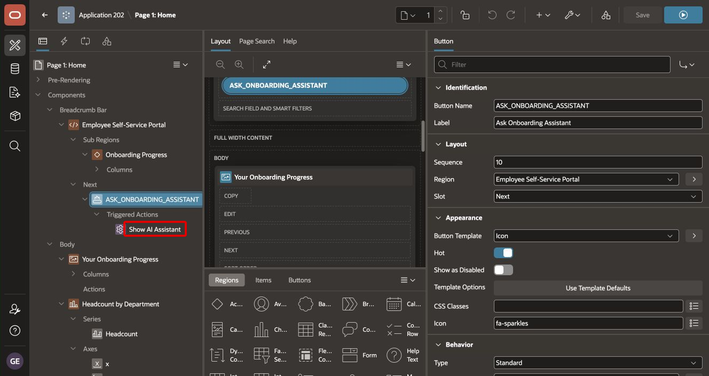

4. Use the native AI Assistant presentation. Do not add custom JavaScript, a custom chatbot region, or an employee-ID page item.

5. Save the page.

## Task 8: Test the Assistant as an Employee

1. Confirm that the test employee's login name matches a value in `TMS_EMPLOYEES.EMAIL`. The comparison is case-insensitive.

2. Run ESS and sign in as that employee.

3. On ESS Home, select **Ask Onboarding Assistant**.

4. Enter the LiveLab test prompt:

    ```text
    What is the company policy on annual leave?
    ```

5. Verify that the agent calls `get_hr_policy` and bases its answer on the returned policy text.

6. Test task retrieval with:

    ```text
    Which onboarding tasks do I still need to complete?
    ```

7. Verify that the assistant lists only the signed-in employee's tasks and identifies incomplete or overdue entries.

8. To test the update path, identify one incomplete task from the assistant response. Then enter:

    ```text
    I completed task <task-id>. Mark it complete.
    ```

9. Review any confirmation that appears. Confirm only the task ID you intended to complete.

10. Ask for the task list again. Confirm that the selected task now has status `Done`.

## Summary

You created an Onboarding Assistant that retrieves live employee data, answers from HR policy records, and performs an employee-scoped task update. You exposed the agent through the native AI Assistant on ESS Home.

You may now **proceed to the next lab**.

## Acknowledgements

- **Author** - Shanmukh Kornana
- **Last Updated By/Date** - Shanmukh Kornana, August 2026
