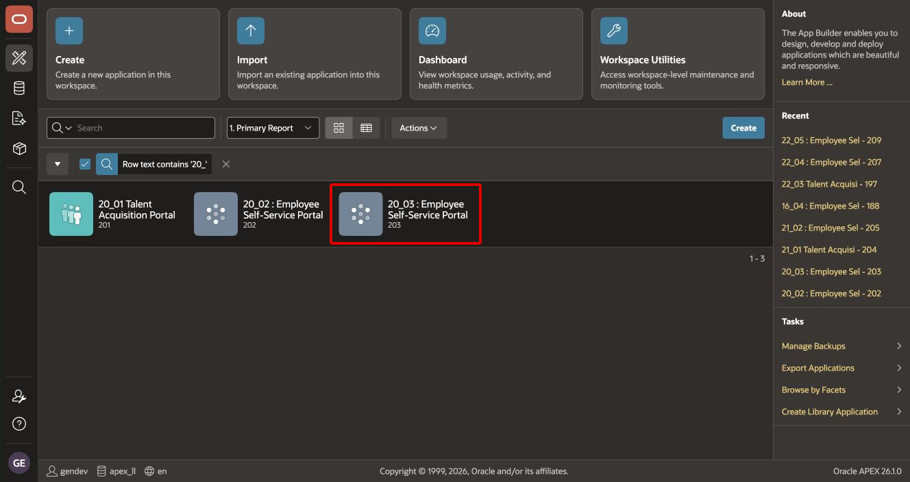
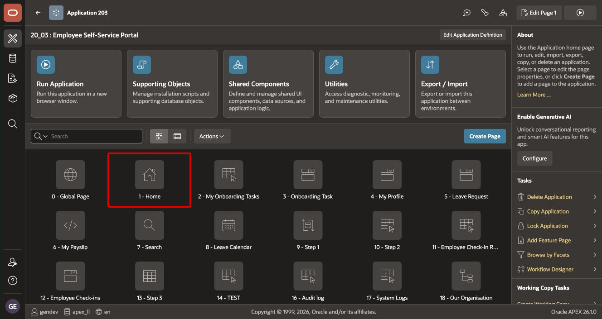
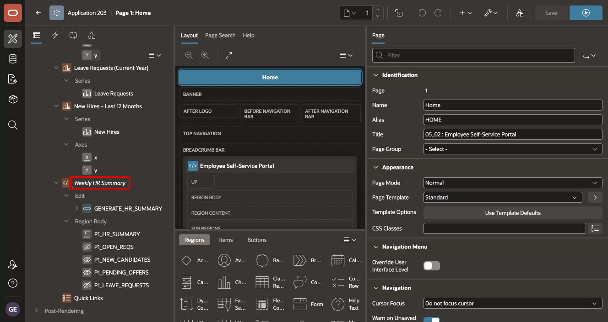
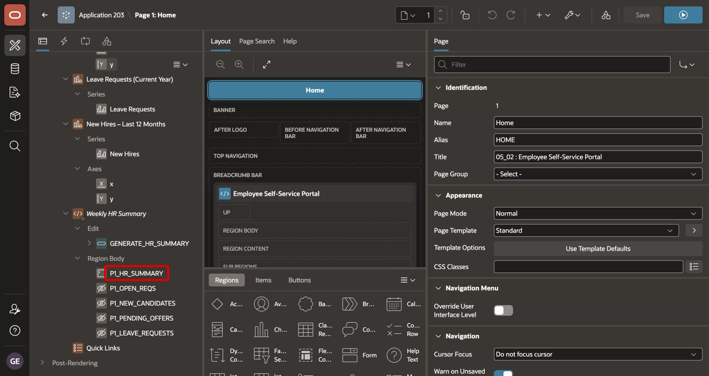
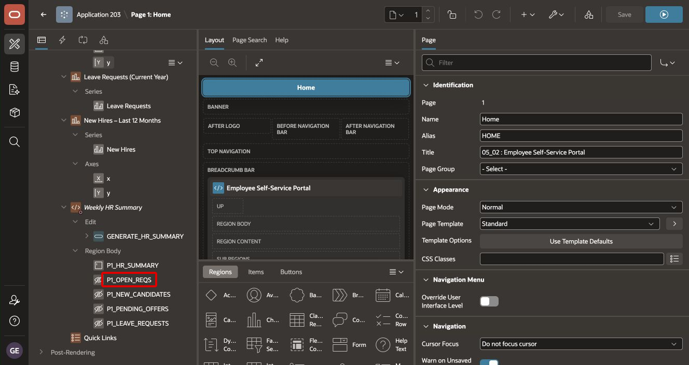
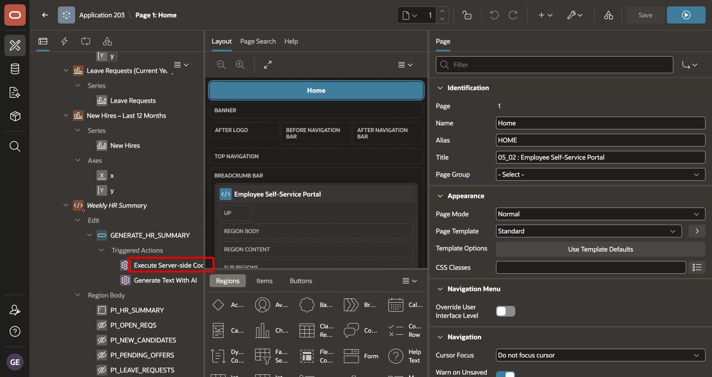
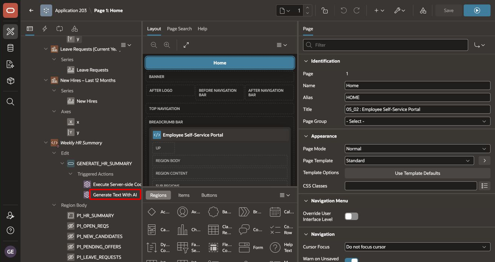

# Build the Weekly HR AI Summary

## Introduction

In this lab, you will add an HR Admin-only region to ESS Home. A button first calculates four current HR metrics on the server. A second action sends only those metrics to the configured AI service and writes a concise weekly briefing to a read-only item.

Estimated Time: 20 minutes

### Objectives

In this lab, you will:

- Create the Weekly HR Summary region.
- Restrict the region with `IS_HR_ADMIN`.
- Add a read-only AI result item and four hidden metric items.
- Populate live HR metrics through PL/SQL.
- Generate a three-sentence summary with AI.
- Verify action order and runtime behavior.

## Task 1: Open ESS Home in Page Designer

1. In App Builder, open **Employee Self-Service Portal**.

    

2. Open **Page 1: Home**.

    

3. Review the existing page layout from Module 19. The new region must appear above the three HR charts.

    ```text
    ESS Home
    ├── Metric Cards
    ├── Onboarding Progress
    ├── Weekly HR Summary
    ├── Headcount by Department
    ├── Leave Requests by Type
    └── New Hires - Last 12 Months
    ```

## Task 2: Create the Weekly HR Summary Region

1. In the Rendering tree, right-click **Body** and select **Create Region**.

2. Configure the region:

    | Property | Value |
    | --- | --- |
    | Title | `Weekly HR Summary` |
    | Type | Static Content |
    | Authorization Scheme | IS_HR_ADMIN |

3. Move the region above **Headcount by Department** and the other HR charts.

4. Verify the region in the Rendering tree.

    

The authorization scheme protects the complete region, including its button, metrics, and AI-generated text.

## Task 3: Add the Summary and Metric Items

1. Right-click **Weekly HR Summary**, and select **Create Page Item**.

2. Configure the AI result item:

    | Property | Value |
    | --- | --- |
    | Name | `P1_HR_SUMMARY` |
    | Type | Textarea |
    | Label | `Weekly HR Summary` |
    | Read Only | Always |
    | Rows | 5 |

    

    Read-only status prevents a user from editing generated text and mistaking it for the current AI result.

3. Create four more page items under the region. Set **Type** to **Hidden** for each item:

    | Item Name | Purpose |
    | --- | --- |
    | `P1_OPEN_REQS` | Number of open job requisitions |
    | `P1_NEW_CANDIDATES` | Candidates who applied during the current ISO week |
    | `P1_PENDING_OFFERS` | Offers pending approval |
    | `P1_LEAVE_REQUESTS` | Leave requests starting during the current ISO week |

    

4. Save the page.

## Task 4: Add the Generate Weekly Summary Button

1. Right-click **Weekly HR Summary**, and select **Create Button**.

2. Configure the button:

    | Property | Value |
    | --- | --- |
    | Button Name | `GENERATE_HR_SUMMARY` |
    | Label | `Generate Weekly HR Summary` |
    | Icon | `fa-sparkles` |
    | Position | Edit |
    | Action | Defined by Dynamic Action |

3. Verify the button in the Rendering tree.

    

4. Save the page.

## Task 5: Retrieve Current HR Metrics

1. Select **GENERATE_HR_SUMMARY** and expand **Triggered Actions**.

2. Create a True Action.

3. Configure the action:

    | Property | Value |
    | --- | --- |
    | Name | `Execute Server-side Code` |
    | Action | Execute Server-side Code |

4. Enter this PL/SQL code:

    ```plsql
    BEGIN
        SELECT COUNT(*)
          INTO :P1_OPEN_REQS
          FROM tms_job_requisitions
         WHERE status = 'Open';

        SELECT COUNT(*)
          INTO :P1_NEW_CANDIDATES
          FROM tms_candidates
         WHERE applied_date >= TRUNC(SYSDATE, 'IW');

        SELECT COUNT(*)
          INTO :P1_PENDING_OFFERS
          FROM tms_offers
         WHERE status = 'Pending Approval';

        SELECT COUNT(*)
          INTO :P1_LEAVE_REQUESTS
          FROM tms_leave_requests
         WHERE start_date >= TRUNC(SYSDATE, 'IW');
    END;
    ```

5. For **Items to Return**, enter:

    ```text
    P1_OPEN_REQS,P1_NEW_CANDIDATES,P1_PENDING_OFFERS,P1_LEAVE_REQUESTS
    ```

    This property returns the server-side values to the browser session before the next Trigger Action runs.

6. Verify the action beneath the button.

    

## Task 6: Generate the HR Summary with AI

1. Under the same button, create a second True Action after **Execute Server-side Code**.

2. Configure the action:

    | Property | Value |
    | --- | --- |
    | Name | `Generate Text With AI` |
    | Action | Generate Text with AI |

3. Enter this prompt:

    ```text
    Summarize this week's HR activity for Acme Corp.

    Open requisitions: &P1_OPEN_REQS.
    New candidates this week: &P1_NEW_CANDIDATES.
    Pending offers: &P1_PENDING_OFFERS.
    Leave requests this week: &P1_LEAVE_REQUESTS.

    Provide a concise three-sentence summary suitable for an HR Director.
    Highlight anything that may require attention.
    Only use the supplied metrics and do not invent additional facts.
    ```

4. For **Result** or **Affected Item**, select `P1_HR_SUMMARY`.

5. Verify the action in the Rendering tree.

    

6. Save the page.

## Task 7: Verify the Action Execution Order

1. Expand `GENERATE_HR_SUMMARY > Triggered Actions`.

2. Confirm that the actions appear in this order:

    ```text
    GENERATE_HR_SUMMARY
        ↓
    Execute Server-side Code
        ↓
    Populate P1_OPEN_REQS
             P1_NEW_CANDIDATES
             P1_PENDING_OFFERS
             P1_LEAVE_REQUESTS
        ↓
    Generate Text With AI
        ↓
    P1_HR_SUMMARY
    ```

3. If the AI action appears first, drag **Execute Server-side Code** above it.

The order is required. The AI prompt reads the page-item values returned by the first action.

## Task 8: Test the Weekly Summary as an HR Administrator

1. Run ESS and sign in as an HR Admin.

2. Open **Home**.

3. Confirm that **Weekly HR Summary** appears above the HR charts.

4. Select **Generate Weekly HR Summary**.

5. Wait for the Generative AI request to complete.

6. Verify that `P1_HR_SUMMARY` displays a concise three-sentence summary.

7. Compare each number in the summary with the supplied metrics. The response must not introduce additional facts, causes, names, or forecasts.

8. Sign in as a user who does not satisfy `IS_HR_ADMIN`, or ask another workshop participant to test that role.

9. Confirm that the complete **Weekly HR Summary** region is hidden.

## Summary

You created an HR Admin-only weekly briefing that calculates current HR metrics and sends only those values to the AI service. You also verified the action sequence, generated result, and authorization behavior.

You may now **proceed to the next module**.

## Acknowledgements

- **Author** - Shanmukh Kornana
- **Last Updated By/Date** - Shanmukh Kornana, August 2026
